# Yemen Telecom SIM Management System — Architecture Document

> **Version**: 1.0.0
> **Scope**: Production-grade architecture for the Yemen Telecom SIM Management System
> **Source**: Reverse-engineered from source code at `C:\Users\Ahmed\Desktop\yemen-telecom` (server/src/, src/, render.yaml, capacitor.config.ts, migrations/)

---

## Phase 1: Domain Model & Entity-Relationship Diagram

### Mermaid ERD

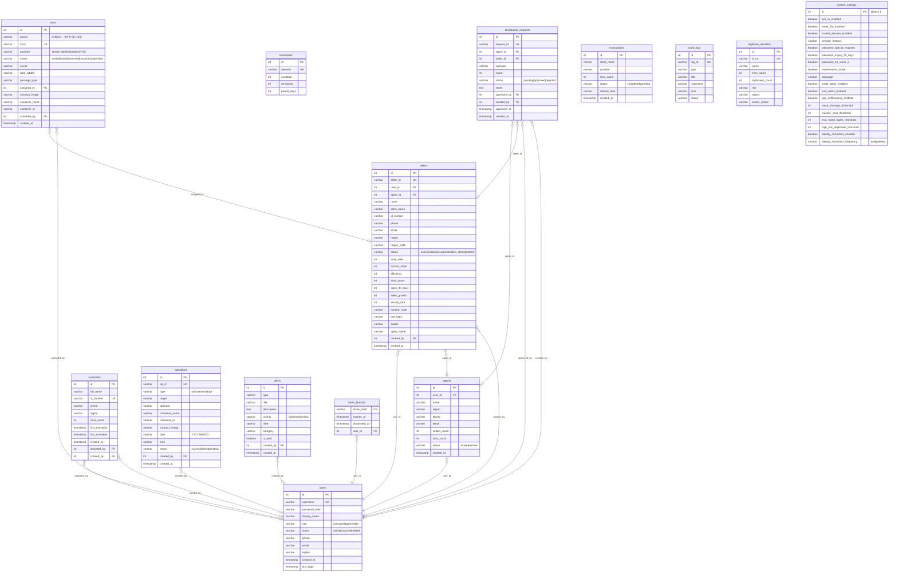

### PlantUML Class Diagram

```plantuml
@startuml
!theme plain
skinparam classFontSize 12
skinparam classFontName Consolas
skinparam backgroundColor #FEFEFE
skinparam shadowing false

class users {
  + id: SERIAL PK
  + username: VARCHAR(100) UNIQUE NOT NULL
  + password_hash: VARCHAR(255) NOT NULL
  + display_name: VARCHAR(200) DEFAULT ''
  + role: VARCHAR(20) CHECK(manager|agent|seller)
  + status: VARCHAR(20) DEFAULT 'active'
  + phone: VARCHAR(50) DEFAULT ''
  + email: VARCHAR(200) DEFAULT ''
  + region: VARCHAR(200) DEFAULT ''
  + created_at: TIMESTAMP DEFAULT NOW()
  + last_login: TIMESTAMP
}

class agents {
  + id: SERIAL PK
  + user_id: INTEGER UNIQUE FK
  + name: VARCHAR(200) NOT NULL
  + region: VARCHAR(200) DEFAULT ''
  + phone: VARCHAR(50) DEFAULT ''
  + email: VARCHAR(200) DEFAULT ''
  + sellers_count: INTEGER DEFAULT 0
  + sims_count: INTEGER DEFAULT 0
  + status: VARCHAR(20) DEFAULT 'active'
  + created_at: TIMESTAMP DEFAULT NOW()
}

class sellers {
  + id: SERIAL PK
  + seller_id: VARCHAR(50) UNIQUE NOT NULL
  + user_id: INTEGER UNIQUE FK
  + agent_id: INTEGER FK
  + name: VARCHAR(200) NOT NULL
  + store_name: VARCHAR(200) DEFAULT ''
  + id_number: VARCHAR(50) DEFAULT ''
  + phone: VARCHAR(50) DEFAULT ''
  + email: VARCHAR(200) DEFAULT ''
  + region: VARCHAR(200) DEFAULT ''
  + region_code: VARCHAR(50) DEFAULT ''
  + status: VARCHAR(20) DEFAULT 'active'
  + total_sales: INTEGER DEFAULT 0
  + current_stock: INTEGER DEFAULT 0
  + efficiency: INTEGER DEFAULT 0
  + sims_count: INTEGER DEFAULT 0
  + sales_30_days: INTEGER DEFAULT 0
  + sales_growth: INTEGER DEFAULT 0
  + activity_rate: INTEGER DEFAULT 0
  + creation_date: VARCHAR(20) DEFAULT ''
  + last_login: VARCHAR(100) DEFAULT ''
  + avatar: VARCHAR(500) DEFAULT ''
  + agent_name: VARCHAR(200) DEFAULT ''
  + created_by: INTEGER FK
  + created_at: TIMESTAMP DEFAULT NOW()
}

class sims {
  + id: SERIAL PK
  + phone: VARCHAR(50) DEFAULT ''
  + iccid: VARCHAR(50) UNIQUE NOT NULL
  + provider: VARCHAR(50) DEFAULT 'Yemen Mobile'
  + status: VARCHAR(20) DEFAULT 'available'
  + owner: VARCHAR(200) DEFAULT 'المركز الرئيسي'
  + date_added: VARCHAR(20) DEFAULT ''
  + package_type: VARCHAR(100) DEFAULT 'باقة مزايا الشهرية'
  + assigned_to: INTEGER FK
  + contract_image: VARCHAR(500) DEFAULT ''
  + customer_name: VARCHAR(200) DEFAULT ''
  + customer_id: VARCHAR(50) DEFAULT ''
  + activated_by: INTEGER FK
  + created_at: TIMESTAMP DEFAULT NOW()
}

class customers {
  + id: SERIAL PK
  + full_name: VARCHAR(200) NOT NULL
  + id_number: VARCHAR(50) UNIQUE NOT NULL
  + phone: VARCHAR(50) DEFAULT ''
  + region: VARCHAR(200) DEFAULT ''
  + sims_count: INTEGER DEFAULT 1
  + first_activation: TIMESTAMP DEFAULT NOW()
  + last_activation: TIMESTAMP DEFAULT NOW()
  + created_at: TIMESTAMP DEFAULT NOW()
  + activated_by: INTEGER FK
  + created_by: INTEGER FK
}

class operations {
  + id: SERIAL PK
  + op_id: VARCHAR(100) UNIQUE NOT NULL
  + type: VARCHAR(20) CHECK(activate|recharge)
  + target: VARCHAR(100) DEFAULT ''
  + operator: VARCHAR(50) DEFAULT ''
  + customer_name: VARCHAR(200)
  + customer_id: VARCHAR(50)
  + contract_image: VARCHAR(500)
  + date: VARCHAR(20) DEFAULT ''
  + time: VARCHAR(50) DEFAULT ''
  + status: VARCHAR(20) DEFAULT 'success'
  + created_by: INTEGER FK
  + created_at: TIMESTAMP DEFAULT NOW()
}

class inventories {
  + id: SERIAL PK
  + operator: VARCHAR(50) UNIQUE NOT NULL
  + available: INTEGER DEFAULT 0
  + remaining: INTEGER DEFAULT 0
  + period_days: INTEGER DEFAULT 0
}

class alerts {
  + id: SERIAL PK
  + title: VARCHAR(300) NOT NULL
  + description: TEXT DEFAULT ''
  + priority: VARCHAR(10) CHECK(high|medium|low)
  + time: VARCHAR(50) DEFAULT ''
  + category: VARCHAR(100) DEFAULT ''
  + is_read: BOOLEAN DEFAULT FALSE
  + created_by: INTEGER FK
  + created_at: TIMESTAMP DEFAULT NOW()
}

class distribution_requests {
  + id: SERIAL PK
  + request_id: VARCHAR(100) UNIQUE NOT NULL
  + agent_id: INTEGER FK
  + seller_id: INTEGER FK
  + operator: VARCHAR(50) NOT NULL
  + count: INTEGER NOT NULL
  + status: VARCHAR(20) DEFAULT 'pending'
  + notes: TEXT DEFAULT ''
  + approved_by: INTEGER FK
  + created_by: INTEGER FK
  + approved_at: TIMESTAMP
  + created_at: TIMESTAMP DEFAULT NOW()
}

class transactions {
  + id: SERIAL PK
  + client_name: VARCHAR(200) NOT NULL
  + provider: VARCHAR(50) DEFAULT 'Yemen Mobile'
  + sims_count: INTEGER DEFAULT 0
  + status: VARCHAR(20) DEFAULT 'completed'
  + relative_time: VARCHAR(50) DEFAULT ''
  + created_at: TIMESTAMP DEFAULT NOW()
}

class audit_logs {
  + id: SERIAL PK
  + log_id: VARCHAR(100) UNIQUE NOT NULL
  + type: VARCHAR(50) DEFAULT ''
  + title: VARCHAR(300) DEFAULT ''
  + username: VARCHAR(200) DEFAULT ''
  + time: VARCHAR(50) DEFAULT ''
  + status: VARCHAR(20) DEFAULT ''
}

class duplicate_identities {
  + id: SERIAL PK
  + id_no: VARCHAR(50) UNIQUE NOT NULL
  + name: VARCHAR(200) NOT NULL
  + sims_count: INTEGER DEFAULT 0
  + duplicates_count: INTEGER DEFAULT 0
  + risk: VARCHAR(50) DEFAULT ''
  + region: VARCHAR(200) DEFAULT ''
  + avatar_initials: VARCHAR(10) DEFAULT ''
}

class system_settings {
  + id: INTEGER PK DEFAULT 1
  + two_fa_enabled: BOOLEAN DEFAULT TRUE
  + email_2fa_enabled: BOOLEAN DEFAULT FALSE
  + trusted_devices_enabled: BOOLEAN DEFAULT TRUE
  + session_timeout: VARCHAR(50) DEFAULT '30 دقيقة'
  + password_special_required: BOOLEAN DEFAULT TRUE
  + password_expiry_90_days: BOOLEAN DEFAULT TRUE
  + password_no_reuse_5: BOOLEAN DEFAULT FALSE
  + maintenance_mode: BOOLEAN DEFAULT FALSE
  + language: VARCHAR(100) DEFAULT 'العربية (المملكة العربية السعودية)'
  + email_alerts_enabled: BOOLEAN DEFAULT TRUE
  + sms_alerts_enabled: BOOLEAN DEFAULT TRUE
  + app_notifications_enabled: BOOLEAN DEFAULT FALSE
  + stock_shortage_threshold: INTEGER DEFAULT 5
  + inactive_sims_threshold: INTEGER DEFAULT 90
  + max_failed_logins_threshold: INTEGER DEFAULT 3
  + high_risk_duplicates_threshold: INTEGER DEFAULT 5
  + identity_reminders_enabled: BOOLEAN DEFAULT TRUE
  + identity_reminders_frequency: VARCHAR(10) DEFAULT 'weekly'
}

class token_blacklist {
  + token_hash: VARCHAR(64) PK
  + expires_at: TIMESTAMP NOT NULL
  + blacklisted_at: TIMESTAMP
  + user_id: INTEGER FK
}

users  ||..o{ agents    : "user_id (UNIQUE)"
users  ||..o{ sellers   : "user_id (UNIQUE)"
users  ||..o{ token_blacklist : "user_id ON DELETE CASCADE"
users  }o..o{ sellers   : "created_by ON DELETE SET NULL"
users  }o..o{ sims      : "activated_by ON DELETE SET NULL"
users  }o..o{ operations : "created_by ON DELETE SET NULL"
users  }o..o{ alerts     : "created_by ON DELETE SET NULL"
users  }o..o{ distribution_requests : "approved_by ON DELETE SET NULL"
users  }o..o{ distribution_requests : "created_by ON DELETE SET NULL"
users  }o..o{ customers  : "activated_by ON DELETE SET NULL"
users  }o..o{ customers  : "created_by ON DELETE SET NULL"
agents ||..o{ sellers    : "agent_id ON DELETE SET NULL"
agents }o..o{ distribution_requests : "agent_id ON DELETE SET NULL"
sellers }o..o{ sims      : "assigned_to ON DELETE SET NULL"
sellers ||..o{ distribution_requests : "seller_id ON DELETE CASCADE"
@enduml
```

---

## Phase 2: System Architecture Diagram

### Mermaid C4-Level Container Diagram

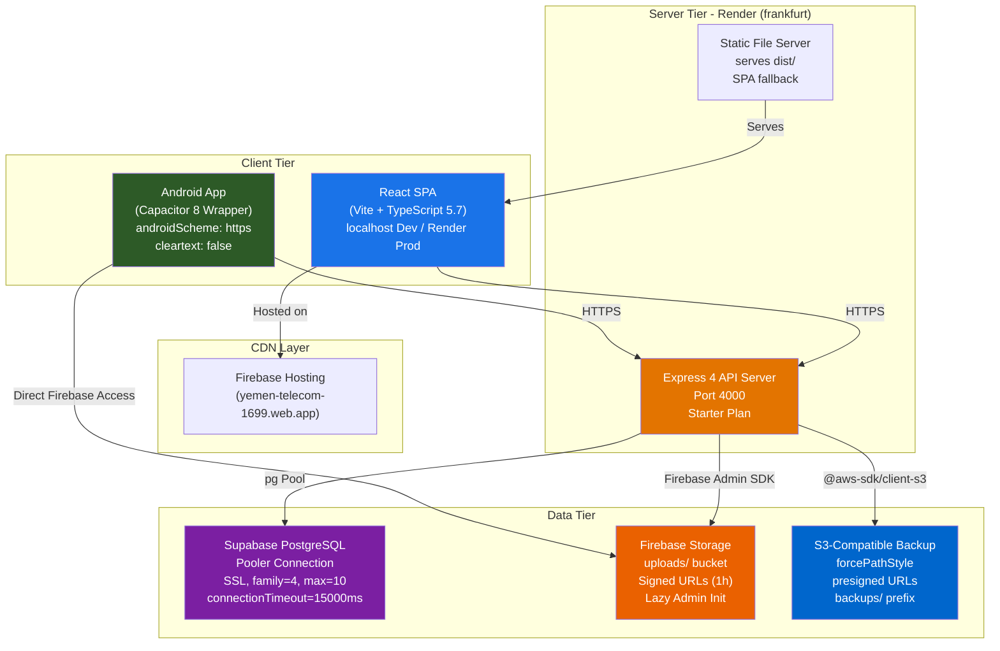

### PlantUML Component Diagram

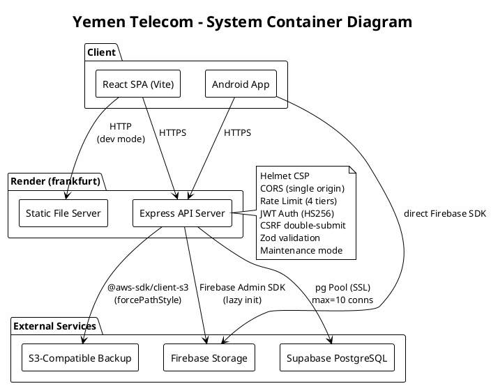

---

## Phase 3: Frontend Component Diagram

### Mermaid Component Graph

```mermaid
graph TB
    subgraph "React App Entry"
        main["src/main.tsx\nReactDOM.createRoot"]
    end

    subgraph "Root Component"
        App["src/App.tsx"]
    end

    subgraph "Auth & Boot"
        useAuth["src/hooks/useAuth.ts\nJWT Load from Preferences/localStorage\nGET /me verify\nauto-logout on 401"]
        Splash["SplashScreen.tsx\nBoot animation"]
        Login["LoginScreen.tsx\nRole selection + credentials"]
        useNetwork["src/hooks/useNetworkStatus.ts\nOnline/offline detection"]
    end

    subgraph "HTTP Layer"
        apiClient["src/api/client.ts\nAbortController 15s timeout\nCSRF double-submit\nJWT refresh rotation\n429 guard + request dedup"]
        tokenStorage["src/services/tokenStorage.ts\nCapacitor Preferences / localStorage\nisNative detection"]
    end

    subgraph "Shared Hooks"
        useManager["src/hooks/useManagerState.ts\nManager state management"]
        useAgentSeller["src/hooks/useAgentSellerState.ts\nAgent/Seller state management"]
        useOcr["src/hooks/useOcr.ts\nTesseract.js worker\n30s timeout, 2 retries\nOtsu binarization\nArabic traineddata"]
        useDebounce["src/hooks/useDebounce.ts"]
        useMounted["src/hooks/useMountedRef.ts"]
    end

    subgraph "Monitoring"
        monitor["src/lib/monitor.ts\nRing buffer (200 entries)\nSecret redaction\nSLOW threshold 1000ms"]
    end

    subgraph "Types"
        types["src/types.ts\nISim, IAgent, ISeller\nIUser, ICustomer\nIOperation, IInventory\nIAlert, IDistributionRequest\nSystemSettings"]
    end

    subgraph "Manager Dashboard (11 views)"
        DashboardV["DashboardView"]
        SIMsV["SIMsView"]
        CustomersV["CustomersView"]
        AgentsV["AgentsView"]
        SellersV["SellersView"]
        InventoryV["InventoryView\n(part of agent state)"]
        AlertsV["AlertsView"]
        ReportsV["ReportsView"]
        SettingsV["SettingsView"]
        DistributionV["DistributionView\n(part of agent state)"]
        AuditLogV["AuditLogView\n(part of agent state)"]
        GeoRiskV["GeographicRiskView"]
        AddAgentV["AddAgentView"]
        AddSellerV["AddSellerForm"]
        ActivateV["ActivateSimForm"]
    end

    subgraph "Agent Dashboard (4 views)"
        AgentDB["AgentDashboard"]
        AgentSIMs["SIMs (via agent state)"]
        AgentCustomers["Customers (agent-scoped)"]
        AgentDist["Distribution (agent-scoped)"]
        AgentProfile["AgentProfileView"]
    end

    subgraph "Seller Dashboard (4 views)"
        SellerDB["SellerDashboard"]
        SellerSIMs["SIMs (my available)"]
        SellerCustomers["Customers (all)"]
        SellerSettings["Settings (seller)"]
        ActivateForm["ActivateSimForm"]
    end

    subgraph "Shared Components"
        TopBar["TopBar.tsx"]
        NavBar["NavBar.tsx"]
        BottomNav["BottomNav.tsx"]
        Loading["shared/LoadingScreen.tsx"]
        ErrorB["shared/ErrorBoundary.tsx"]
    end

    main --> App
    App --> Splash
    App --> Login
    App --> useAuth
    App --> useNetwork
    App --> useManager
    App --> useAgentSeller
    App --> monitor

    useAuth --> apiClient
    useAuth --> tokenStorage
    useManager --> apiClient
    useAgentSeller --> apiClient

    App --> DashboardV
    App --> SIMsV
    App --> CustomersV
    App --> AgentsV
    App --> SellersV
    App --> AlertsV
    App --> ReportsV
    App --> SettingsV
    App --> GeoRiskV
    App --> AddAgentV
    App --> AddSellerV
    App --> ActivateV

    App --> AgentDB
    App --> AgentProfile
    App --> SellerDB

    App --> TopBar
    App --> NavBar
    App --> BottomNav
    App --> Loading
    App --> ErrorB

    apiClient --> types
    useOcr --> types
```

### PlantUML Component Diagram

```plantuml
@startuml
!theme plain
skinparam componentStyle rectangle
skinparam backgroundColor #FEFEFE

title "Frontend Component Architecture"

package "src/" {
  [main.tsx] as Main
  [App.tsx] as Root
  [types.ts] as Types

  package "api/" {
    [client.ts] as APIClient
  }

  package "hooks/" {
    [useAuth.ts] as UseAuth
    [useManagerState.ts] as UseMgr
    [useAgentSellerState.ts] as UseAgtSlr
    [useOcr.ts] as UseOcr
    [useNetworkStatus.ts] as UseNet
    [useDebounce.ts] as UseDeb
    [useMountedRef.ts] as UseMounted
  }

  package "services/" {
    [tokenStorage.ts] as TokenStore
  }

  package "lib/" {
    [monitor.ts] as Monitor
    [safe.ts] as Safe
    [getErrorMessage.ts] as ErrMsg
  }

  package "components/" {
    [SplashScreen.tsx] as Splash
    [LoginScreen.tsx] as Login
    [TopBar.tsx] as TopBar
    [NavBar.tsx] as NavBar
    [BottomNav.tsx] as BottomNav
    [DashboardView.tsx] as Dash
    [SIMsView.tsx] as Sims
    [AgentsView.tsx] as Agents
    [SellersView.tsx] as Sellers
    [AlertsView.tsx] as Alerts
    [GeographicRiskView.tsx] as GeoRisk
    [ReportsView.tsx] as Reports
    [SettingsView.tsx] as Settings
    [AddAgentView.tsx] as AddAgent
    [AddSellerForm.tsx] as AddSeller
    [ActivateSimForm.tsx] as Activate
    [AgentDashboard.tsx] as AgtDash
    [AgentProfileView.tsx] as AgtProfile
    [SellerDashboard.tsx] as SlrDash

    package "shared/" {
      [ErrorBoundary.tsx] as ErrB
      [LoadingScreen.tsx] as Loading
    }
  }
}

Main --> Root
Root --> UseAuth
Root --> UseMgr
Root --> UseAgtSlr
Root --> UseNet
Root --> Monitor

UseAuth --> APIClient
UseAuth --> TokenStore
UseMgr --> APIClient
UseAgtSlr --> APIClient
APIClient --> Types

Root --> Splash
Root --> Login
Root --> Dash
Root --> Sims
Root --> Agents
Root --> Sellers
Root --> Alerts
Root --> GeoRisk
Root --> Reports
Root --> Settings
Root --> AddAgent
Root --> AddSeller
Root --> Activate
Root --> AgtDash
Root --> AgtProfile
Root --> SlrDash
Root --> TopBar
Root --> NavBar
Root --> BottomNav
Root --> ErrB
Root --> Loading

@enduml
```

---

## Phase 4: Backend Component Diagram

### Mermaid Middleware Stack Graph

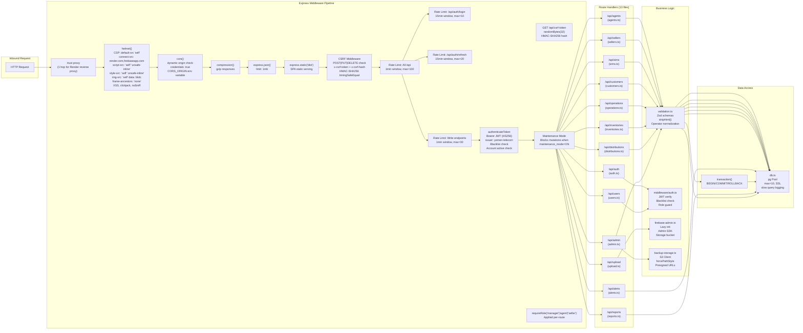

### PlantUML Deployment/Component Diagram

```plantuml
@startuml
!theme plain
skinparam componentStyle rectangle
skinparam backgroundColor #FEFEFE

title "Backend Express Middleware Stack"

node "Inbound Request" as In

package "Express Middleware Pipeline" {
  [trust proxy] as T1
  [helmet()] as T2
  [cors()] as T3
  [compression()] as T4
  [express.json() 1mb] as T5
  [express.static(dist)] as T6
  [CSRF HMAC-SHA256] as T7
  [Rate Limit: Global 100/min] as T8a
  [Rate Limit: Auth 10/15min] as T8b
  [Rate Limit: Write 30/min] as T8c
  [JWT authenticateToken] as T9
  [Maintenance Mode] as T10
}

package "Route Modules" {
  [auth.ts] as R1
  [users.ts] as R2
  [agents.ts] as R3
  [sellers.ts] as R4
  [sims.ts] as R5
  [customers.ts] as R6
  [operations.ts] as R7
  [inventories.ts] as R8
  [alerts.ts] as R9
  [distributions.ts] as R10
  [reports.ts] as R11
  [admin.ts] as R12
  [upload.ts] as R13
}

package "Backend Services" {
  [db.ts (pg Pool)] as DB
  [validation.ts (Zod)] as VAL
  [middleware/auth.ts] as MW
  [firebase-admin.ts] as FB
  [backup-storage.ts] as S3
}

In --> T1 --> T2 --> T3 --> T4 --> T5 --> T6
T6 --> T7 --> T8a --> T8b --> T8c --> T9 --> T10

T10 --> R1
T10 --> R2
T10 --> R3 : requireRole(manager)
T10 --> R4 : requireRole(manager,agent)
T10 --> R5 : requireRole(manager,agent)
T10 --> R6 : requireRole(manager,agent,seller)
T10 --> R7 : requireRole(manager,agent)
T10 --> R8 : requireRole(manager,agent)
T10 --> R9 : requireRole(manager)
T10 --> R10 : requireRole(manager,agent)
T10 --> R11 : requireRole(manager,agent)
T10 --> R12 : requireRole(manager)
T10 --> R13 : requireRole(manager,agent)

R3 --> VAL --> DB
R4 --> VAL --> DB
R5 --> VAL --> DB
R6 --> VAL --> DB
R7 --> VAL --> DB
R8 --> VAL --> DB
R10 --> DB : transactions
R12 --> DB
R12 --> S3
R13 --> FB

@enduml
```

---

## Phase 5: Full Database ERD

### Mermaid ERD — Full Details

```mermaid
erDiagram
    users {
        int id PK "serial"
        varchar username UK "NOT NULL"
        varchar password_hash "NOT NULL, bcrypt"
        varchar display_name "DEFAULT ''"
        varchar role "CHECK manager|agent|seller"
        varchar status "DEFAULT 'active' CHECK active|inactive|deleted"
        varchar phone "DEFAULT ''"
        varchar email "DEFAULT ''"
        varchar region "DEFAULT ''"
        timestamp created_at "DEFAULT NOW()"
        timestamp last_login
        %% Indexes: (status), (phone), (role,username)
    }

    agents {
        int id PK "serial"
        int user_id FK "UNIQUE → users(id) ON DELETE CASCADE"
        varchar name "NOT NULL"
        varchar region "DEFAULT ''"
        varchar phone "UNIQUE WHERE non-empty"
        varchar email "DEFAULT ''"
        int sellers_count "DEFAULT 0"
        int sims_count "DEFAULT 0"
        varchar status "DEFAULT 'active' CHECK active|inactive"
        timestamp created_at "DEFAULT NOW()"
        %% Indexes: (status), (region), (user_id), (name)
    }

    sellers {
        int id PK "serial"
        varchar seller_id UK "NOT NULL"
        int user_id FK "UNIQUE → users(id) ON DELETE CASCADE"
        int agent_id FK "→ agents(id) ON DELETE SET NULL"
        varchar name "NOT NULL"
        varchar store_name "DEFAULT ''"
        varchar id_number "DEFAULT ''"
        varchar phone "DEFAULT ''"
        varchar email "DEFAULT ''"
        varchar region "DEFAULT ''"
        varchar region_code "DEFAULT ''"
        varchar status "DEFAULT 'active' CHECK active|inactive|suspended|low_stock|deleted"
        int total_sales "DEFAULT 0"
        int current_stock "DEFAULT 0"
        int efficiency "DEFAULT 0"
        int sims_count "DEFAULT 0"
        int sales_30_days "DEFAULT 0"
        int sales_growth "DEFAULT 0"
        int activity_rate "DEFAULT 0"
        varchar creation_date "DEFAULT ''"
        varchar last_login "DEFAULT ''"
        varchar avatar "DEFAULT ''"
        varchar agent_name "DEFAULT ''"
        int created_by FK "→ users(id) ON DELETE SET NULL"
        timestamp created_at "DEFAULT NOW()"
        %% Indexes: (agent_id), (user_id), (agent_name), (phone), (status), (region), (region_code), (id_number)
    }

    sims {
        int id PK "serial"
        varchar phone "DEFAULT '' CHECK ~ ^[0-9+/]{7,15}$"
        varchar iccid UK "NOT NULL"
        varchar provider "DEFAULT 'Yemen Mobile'"
        varchar status "DEFAULT 'available' CHECK available|sold|reserved|inactive|suspended"
        varchar owner "DEFAULT 'المركز الرئيسي'"
        varchar date_added "DEFAULT ''"
        varchar package_type "DEFAULT 'باقة مزايا الشهرية'"
        int assigned_to FK "→ sellers(id) ON DELETE SET NULL"
        varchar contract_image "DEFAULT ''"
        varchar customer_name "DEFAULT ''"
        varchar customer_id "DEFAULT ''"
        int activated_by FK "→ users(id) ON DELETE SET NULL"
        timestamp created_at "DEFAULT NOW()"
        %% Indexes: (iccid), (phone), (provider), (status), (assigned_to), (owner), (customer_name), (customer_id), (created_at), (provider,status)
    }

    customers {
        int id PK "serial"
        varchar full_name "NOT NULL"
        varchar id_number UK "NOT NULL UNIQUE"
        varchar phone "DEFAULT ''"
        varchar region "DEFAULT ''"
        int sims_count "DEFAULT 1"
        timestamp first_activation "DEFAULT NOW()"
        timestamp last_activation "DEFAULT NOW()"
        timestamp created_at "DEFAULT NOW()"
        int activated_by FK "→ sellers(id) ON DELETE SET NULL"
        int created_by FK "→ users(id) ON DELETE SET NULL"
        %% Indexes: (id_number), (phone), (full_name)
    }

    operations {
        int id PK "serial"
        varchar op_id UK "NOT NULL"
        varchar type "CHECK activate|recharge"
        varchar target "DEFAULT ''"
        varchar operator "DEFAULT ''"
        varchar customer_name
        varchar customer_id
        varchar contract_image
        varchar date "DEFAULT ''"
        varchar time "DEFAULT ''"
        varchar status "DEFAULT 'success' CHECK success|failed|pending"
        int created_by FK "→ users(id) ON DELETE SET NULL"
        timestamp created_at "DEFAULT NOW()"
        %% Indexes: (status), (target), (operator), (customer_name), (customer_id), (created_at), (type,status), (type)
    }

    inventories {
        int id PK "serial"
        varchar operator UK "NOT NULL"
        int available "DEFAULT 0"
        int remaining "DEFAULT 0"
        int period_days "DEFAULT 0"
        %% Index: (available)
    }

    alerts {
        int id PK "serial"
        varchar type
        varchar title "NOT NULL"
        text description "DEFAULT ''"
        varchar priority "CHECK high|medium|low"
        varchar time "DEFAULT ''"
        varchar category "DEFAULT ''"
        boolean is_read "DEFAULT FALSE"
        int created_by FK "→ users(id) ON DELETE SET NULL"
        timestamp created_at "DEFAULT NOW()"
        %% Indexes: (priority), (category), (time), (is_read), (is_read,priority,time)
    }

    distribution_requests {
        int id PK "serial"
        varchar request_id UK "NOT NULL"
        int agent_id FK "→ agents(id) ON DELETE SET NULL"
        int seller_id FK "→ sellers(id) ON DELETE CASCADE"
        varchar operator "NOT NULL"
        int count "NOT NULL"
        varchar status "DEFAULT 'pending' CHECK pending|approved|rejected"
        text notes "DEFAULT ''"
        int approved_by FK "→ users(id) ON DELETE SET NULL"
        int created_by FK "→ users(id) ON DELETE SET NULL"
        timestamp approved_at
        timestamp created_at "DEFAULT NOW()"
        %% Indexes: (seller_id), (created_at), (status), (agent_id)
    }

    transactions {
        int id PK "serial"
        varchar client_name "NOT NULL"
        varchar provider "DEFAULT 'Yemen Mobile'"
        int sims_count "DEFAULT 0"
        varchar status "DEFAULT 'completed' CHECK completed|pending"
        varchar relative_time "DEFAULT ''"
        timestamp created_at "DEFAULT NOW()"
        %% Indexes: (status), (provider), (client_name)
    }

    audit_logs {
        int id PK "serial"
        varchar log_id UK "NOT NULL"
        varchar type "DEFAULT ''"
        varchar title "DEFAULT ''"
        varchar username "DEFAULT ''"
        varchar time "DEFAULT ''"
        varchar status "DEFAULT ''"
        %% Indexes: (status), (username), (time), (type)
    }

    duplicate_identities {
        int id PK "serial"
        varchar id_no UK "NOT NULL"
        varchar name "NOT NULL"
        int sims_count "DEFAULT 0"
        int duplicates_count "DEFAULT 0"
        varchar risk "DEFAULT ''"
        varchar region "DEFAULT ''"
        varchar avatar_initials "DEFAULT ''"
        %% Indexes: (region), (risk), (name)
    }

    system_settings {
        int id PK "DEFAULT 1, single row"
        boolean two_fa_enabled "DEFAULT TRUE"
        boolean email_2fa_enabled "DEFAULT FALSE"
        boolean trusted_devices_enabled "DEFAULT TRUE"
        varchar session_timeout "DEFAULT '30 دقيقة'"
        boolean password_special_required "DEFAULT TRUE"
        boolean password_expiry_90_days "DEFAULT TRUE"
        boolean password_no_reuse_5 "DEFAULT FALSE"
        boolean maintenance_mode "DEFAULT FALSE"
        varchar language "DEFAULT 'العربية (المملكة العربية السعودية)'"
        boolean email_alerts_enabled "DEFAULT TRUE"
        boolean sms_alerts_enabled "DEFAULT TRUE"
        boolean app_notifications_enabled "DEFAULT FALSE"
        int stock_shortage_threshold "DEFAULT 5"
        int inactive_sims_threshold "DEFAULT 90"
        int max_failed_logins_threshold "DEFAULT 3"
        int high_risk_duplicates_threshold "DEFAULT 5"
        boolean identity_reminders_enabled "DEFAULT TRUE"
        varchar identity_reminders_frequency "DEFAULT 'weekly' CHECK daily|weekly"
    }

    token_blacklist {
        varchar token_hash PK "SHA-256 hex, 64 chars"
        timestamp expires_at "NOT NULL"
        timestamp blacklisted_at
        int user_id FK "→ users(id) ON DELETE CASCADE"
        %% Indexes: (user_id), (expires_at), (expires_at,user_id)
    }

    agents }o--|| users : "user_id (UNIQUE) ON DELETE CASCADE"
    sellers }o--|| users : "user_id (UNIQUE) ON DELETE CASCADE"
    sellers }o--o| agents : "agent_id ON DELETE SET NULL"
    sellers }o--o| users : "created_by ON DELETE SET NULL"
    sims }o--o| sellers : "assigned_to ON DELETE SET NULL"
    sims }o--o| users : "activated_by ON DELETE SET NULL"
    operations }o--o| users : "created_by ON DELETE SET NULL"
    alerts }o--o| users : "created_by ON DELETE SET NULL"
    distribution_requests }o--o| agents : "agent_id ON DELETE SET NULL"
    distribution_requests ||--o| sellers : "seller_id ON DELETE CASCADE"
    distribution_requests }o--o| users : "approved_by ON DELETE SET NULL"
    distribution_requests }o--o| users : "created_by ON DELETE SET NULL"
    customers }o--o| users : "activated_by ON DELETE SET NULL"
    customers }o--o| users : "created_by ON DELETE SET NULL"
    customers }o--o| sellers : "customer.activated_by → sellers(id) ON DELETE SET NULL"
    token_blacklist }o--|| users : "user_id ON DELETE CASCADE"
```

### PlantUML Class Diagram with Cascade Rules

```plantuml
@startuml
!theme plain
skinparam classFontSize 10
skinparam classFontName Consolas
skinparam backgroundColor #FEFEFE
skinparam shadowing false

title "Full Database Schema with Foreign Key Cascade Rules"

' === ENUM COLORS ===
skinparam class {
  BorderColor #333333
}

class users {
  + id: SERIAL PK
  + username: VARCHAR(100) UNIQUE NOT NULL
  + password_hash: VARCHAR(255) NOT NULL
  + display_name: VARCHAR(200) DEFAULT ''
  + role: VARCHAR(20)
  + status: VARCHAR(20) DEFAULT 'active'
  + phone: VARCHAR(50) DEFAULT ''
  + email: VARCHAR(200) DEFAULT ''
  + region: VARCHAR(200) DEFAULT ''
  + created_at: TIMESTAMP DEFAULT NOW()
  + last_login: TIMESTAMP
  ..
  indexes: status, phone, (role,username)
}

class agents {
  + id: SERIAL PK
  + user_id: INTEGER UNIQUE
  + name: VARCHAR(200) NOT NULL
  + region: VARCHAR(200) DEFAULT ''
  + phone: VARCHAR(50) DEFAULT ''
  + email: VARCHAR(200) DEFAULT ''
  + sellers_count: INTEGER DEFAULT 0
  + sims_count: INTEGER DEFAULT 0
  + status: VARCHAR(20) DEFAULT 'active'
  + created_at: TIMESTAMP DEFAULT NOW()
  ..
  indexes: status, region, user_id, name
}

class sellers {
  + id: SERIAL PK
  + seller_id: VARCHAR(50) UNIQUE NOT NULL
  + user_id: INTEGER UNIQUE
  + agent_id: INTEGER
  + name: VARCHAR(200) NOT NULL
  + store_name: VARCHAR(200) DEFAULT ''
  + id_number: VARCHAR(50) DEFAULT ''
  + phone: VARCHAR(50) DEFAULT ''
  + email: VARCHAR(200) DEFAULT ''
  + region: VARCHAR(200) DEFAULT ''
  + region_code: VARCHAR(50) DEFAULT ''
  + status: VARCHAR(20) DEFAULT 'active'
  + total_sales: INTEGER DEFAULT 0
  + current_stock: INTEGER DEFAULT 0
  + efficiency: INTEGER DEFAULT 0
  + sims_count: INTEGER DEFAULT 0
  + sales_30_days: INTEGER DEFAULT 0
  + sales_growth: INTEGER DEFAULT 0
  + activity_rate: INTEGER DEFAULT 0
  + creation_date: VARCHAR(20) DEFAULT ''
  + last_login: VARCHAR(100) DEFAULT ''
  + avatar: VARCHAR(500) DEFAULT ''
  + agent_name: VARCHAR(200) DEFAULT ''
  + created_by: INTEGER
  + created_at: TIMESTAMP DEFAULT NOW()
  ..
  indexes: agent_id, user_id, agent_name, phone, status, region, region_code, id_number, created_at
}

class sims {
  + id: SERIAL PK
  + phone: VARCHAR(50) DEFAULT ''
  + iccid: VARCHAR(50) UNIQUE NOT NULL
  + provider: VARCHAR(50) DEFAULT 'Yemen Mobile'
  + status: VARCHAR(20) DEFAULT 'available'
  + owner: VARCHAR(200) DEFAULT 'المركز الرئيسي'
  + date_added: VARCHAR(20) DEFAULT ''
  + package_type: VARCHAR(100) DEFAULT 'باقة مزايا الشهرية'
  + assigned_to: INTEGER
  + contract_image: VARCHAR(500) DEFAULT ''
  + customer_name: VARCHAR(200) DEFAULT ''
  + customer_id: VARCHAR(50) DEFAULT ''
  + activated_by: INTEGER
  + created_at: TIMESTAMP DEFAULT NOW()
  ..
  indexes: phone, iccid, provider, status, assigned_to, owner, customer_name, customer_id, created_at, (provider,status)
  check: phone ~ '^[0-9+/]{7,15}$'
}

class customers {
  + id: SERIAL PK
  + full_name: VARCHAR(200) NOT NULL
  + id_number: VARCHAR(50) UNIQUE NOT NULL
  + phone: VARCHAR(50) DEFAULT ''
  + region: VARCHAR(200) DEFAULT ''
  + sims_count: INTEGER DEFAULT 1
  + first_activation: TIMESTAMP DEFAULT NOW()
  + last_activation: TIMESTAMP DEFAULT NOW()
  + created_at: TIMESTAMP DEFAULT NOW()
  + activated_by: INTEGER
  + created_by: INTEGER
  ..
  indexes: id_number, phone, full_name
}

class operations {
  + id: SERIAL PK
  + op_id: VARCHAR(100) UNIQUE NOT NULL
  + type: VARCHAR(20)
  + target: VARCHAR(100) DEFAULT ''
  + operator: VARCHAR(50) DEFAULT ''
  + date: VARCHAR(20) DEFAULT ''
  + time: VARCHAR(50) DEFAULT ''
  + status: VARCHAR(20) DEFAULT 'success'
  + customer_name: VARCHAR(200)
  + customer_id: VARCHAR(50)
  + contract_image: VARCHAR(500)
  + created_by: INTEGER
  + created_at: TIMESTAMP DEFAULT NOW()
  ..
  indexes: status, target, operator, customer_name, customer_id, created_at, (type,status), type
}

class inventories {
  + id: SERIAL PK
  + operator: VARCHAR(50) UNIQUE NOT NULL
  + available: INTEGER DEFAULT 0
  + remaining: INTEGER DEFAULT 0
  + period_days: INTEGER DEFAULT 0
  ..
  index: available
}

class alerts {
  + id: SERIAL PK
  + title: VARCHAR(300) NOT NULL
  + description: TEXT DEFAULT ''
  + priority: VARCHAR(10)
  + time: VARCHAR(50) DEFAULT ''
  + category: VARCHAR(100) DEFAULT ''
  + is_read: BOOLEAN DEFAULT FALSE
  + created_by: INTEGER
  + created_at: TIMESTAMP DEFAULT NOW()
  ..
  indexes: priority, category, time, is_read, (is_read,priority,time)
}

class distribution_requests {
  + id: SERIAL PK
  + request_id: VARCHAR(100) UNIQUE NOT NULL
  + agent_id: INTEGER
  + seller_id: INTEGER
  + operator: VARCHAR(50) NOT NULL
  + count: INTEGER NOT NULL
  + status: VARCHAR(20) DEFAULT 'pending'
  + notes: TEXT DEFAULT ''
  + approved_by: INTEGER
  + created_by: INTEGER
  + approved_at: TIMESTAMP
  + created_at: TIMESTAMP DEFAULT NOW()
  ..
  indexes: seller_id, created_at, status, agent_id
}

class transactions {
  + id: SERIAL PK
  + client_name: VARCHAR(200) NOT NULL
  + provider: VARCHAR(50) DEFAULT 'Yemen Mobile'
  + sims_count: INTEGER DEFAULT 0
  + status: VARCHAR(20) DEFAULT 'completed'
  + relative_time: VARCHAR(50) DEFAULT ''
  + created_at: TIMESTAMP DEFAULT NOW()
  ..
  indexes: status, provider, client_name
}

class audit_logs {
  + id: SERIAL PK
  + log_id: VARCHAR(100) UNIQUE NOT NULL
  + type: VARCHAR(50) DEFAULT ''
  + title: VARCHAR(300) DEFAULT ''
  + username: VARCHAR(200) DEFAULT ''
  + time: VARCHAR(50) DEFAULT ''
  + status: VARCHAR(20) DEFAULT ''
  ..
  indexes: status, username, time, type
}

class duplicate_identities {
  + id: SERIAL PK
  + id_no: VARCHAR(50) UNIQUE NOT NULL
  + name: VARCHAR(200) NOT NULL
  + sims_count: INTEGER DEFAULT 0
  + duplicates_count: INTEGER DEFAULT 0
  + risk: VARCHAR(50) DEFAULT ''
  + region: VARCHAR(200) DEFAULT ''
  + avatar_initials: VARCHAR(10) DEFAULT ''
  ..
  indexes: region, risk, name
}

class system_settings {
  + id: INTEGER PK DEFAULT 1
  + two_fa_enabled: BOOLEAN DEFAULT TRUE
  + email_2fa_enabled: BOOLEAN DEFAULT FALSE
  + trusted_devices_enabled: BOOLEAN DEFAULT TRUE
  + session_timeout: VARCHAR(50) DEFAULT '30 دقيقة'
  + password_special_required: BOOLEAN DEFAULT TRUE
  + password_expiry_90_days: BOOLEAN DEFAULT TRUE
  + password_no_reuse_5: BOOLEAN DEFAULT FALSE
  + maintenance_mode: BOOLEAN DEFAULT FALSE
  + language: VARCHAR(100) DEFAULT 'العربية (المملكة العربية السعودية)'
  + email_alerts_enabled: BOOLEAN DEFAULT TRUE
  + sms_alerts_enabled: BOOLEAN DEFAULT TRUE
  + app_notifications_enabled: BOOLEAN DEFAULT FALSE
  + stock_shortage_threshold: INTEGER DEFAULT 5
  + inactive_sims_threshold: INTEGER DEFAULT 90
  + max_failed_logins_threshold: INTEGER DEFAULT 3
  + high_risk_duplicates_threshold: INTEGER DEFAULT 5
  + identity_reminders_enabled: BOOLEAN DEFAULT TRUE
  + identity_reminders_frequency: VARCHAR(10) DEFAULT 'weekly'
}

class token_blacklist {
  + token_hash: VARCHAR(64) PK
  + expires_at: TIMESTAMP NOT NULL
  + blacklisted_at: TIMESTAMP
  + user_id: INTEGER
  ..
  indexes: user_id, expires_at, (expires_at,user_id)
}

' === FK RELATIONSHIPS ===

users  ||--o{ agents          : "user_id ON DELETE CASCADE"
users  ||--o{ sellers         : "user_id ON DELETE CASCADE"
users  ||--o{ token_blacklist : "user_id ON DELETE CASCADE"
users  }o--o{ sellers         : "created_by ON DELETE SET NULL"
users  }o--o{ sims            : "activated_by ON DELETE SET NULL"
users  }o--o{ operations      : "created_by ON DELETE SET NULL"
users  }o--o{ alerts          : "created_by ON DELETE SET NULL"
users  }o--o{ distribution_requests : "approved_by ON DELETE SET NULL"
users  }o--o{ distribution_requests : "created_by ON DELETE SET NULL"
users  }o--o{ customers       : "created_by ON DELETE SET NULL"

agents ||--o{ sellers              : "agent_id ON DELETE SET NULL"
agents }o--o{ distribution_requests : "agent_id ON DELETE SET NULL"

sellers ||--o{ sims                : "assigned_to ON DELETE SET NULL"
sellers ||--o{ distribution_requests : "seller_id ON DELETE CASCADE"
sellers ||--o{ customers           : "customer.activated_by → sellers(id) ON DELETE SET NULL"

@enduml
```

---

## Phase 6: Authentication Sequence Diagram

### Mermaid Sequence Diagram

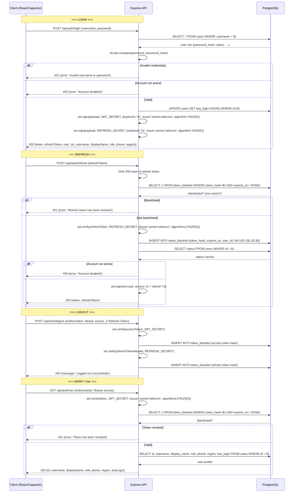

### PlantUML Sequence Diagram

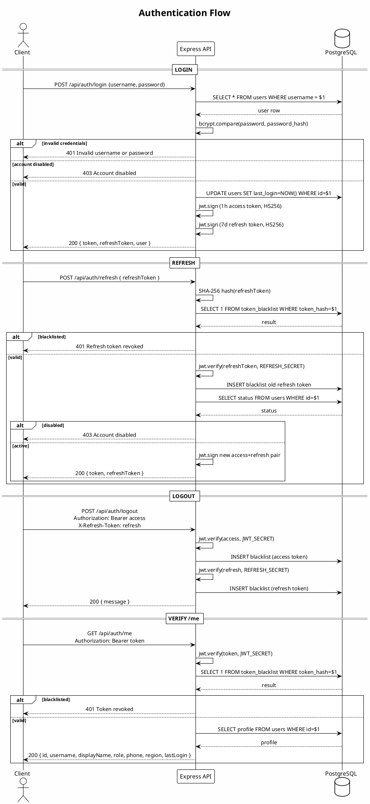

---

## Phase 7: User Flow Activity Diagrams

### Mermaid Activity Diagram

```mermaid
stateDiagram-v2
    state "Manager Workflow" as MGR {
        [*] --> M_Login: Navigate to app
        M_Login --> M_Dashboard: POST /auth/login → credentials
        M_Dashboard --> M_Agents: Select Agents view
        M_Agents --> M_AddAgent: Click Add Agent
        M_AddAgent --> M_Dashboard: Agent created (transaction INSERT user+agent)
        M_Dashboard --> M_Sellers: Select Sellers view
        M_Sellers --> M_AddSeller: Click Add Seller
        M_AddSeller --> M_Sellers: Seller created (transaction INSERT user+seller)
        M_Dashboard --> M_Distributions: Select Distribution view
        M_Distributions --> M_Approve: Click Approve
        M_Approve --> M_Distributions: SELECT FOR UPDATE → UPDATE status → DECREMENT inventory
        M_Dashboard --> M_Reports: Select Reports view
        M_Dashboard --> M_Settings: Select Settings view
        M_Settings --> M_Dashboard: Update system_settings (18 fields)
        M_Dashboard --> M_Logout: Click logout
        M_Logout --> [*]: POST /auth/logout → blacklist tokens
    }

    state "Agent Workflow" as AGT {
        [*] --> A_Login: Navigate to app
        A_Login --> A_Dashboard: POST /auth/login
        A_Dashboard --> A_DistRequest: Select Distribution tab
        A_DistRequest --> A_Dashboard: POST /distributions (DIST-{timestamp})
        A_Dashboard --> A_ManageSellers: Select Sellers tab
        A_ManageSellers --> A_AddSeller: Click Add Seller
        A_AddSeller --> A_ManageSellers: Seller created with agent_name lookup
        A_ManageSellers --> A_ResetPwd: Reset seller password
        A_ResetPwd --> A_ManageSellers: crypto password → bcrypt → update users
        A_Dashboard --> A_ViewCustomers: Select Customers tab
        A_Dashboard --> A_Inventory: View Inventory
        A_Dashboard --> A_Logout: Click logout
        A_Logout --> [*]: POST /auth/logout
    }

    state "Seller Workflow" as SLR {
        [*] --> S_Login: Navigate to app
        S_Login --> S_Dashboard: POST /auth/login
        S_Dashboard --> S_Activate: Select Activate SIM
        S_Activate --> S_ActivateCustomer: Enter customer data / OCR
        S_ActivateCustomer --> S_Dashboard: POST /customers → dedup by id_number → INSERT or UPDATE
        S_Dashboard --> S_ViewCustomers: Select Customers tab
        S_Dashboard --> S_Settings: Select Account/Settings tab
        S_Dashboard --> S_Logout: Click logout
        S_Logout --> [*]: POST /auth/logout
    }
```

### PlantUML Activity Diagram

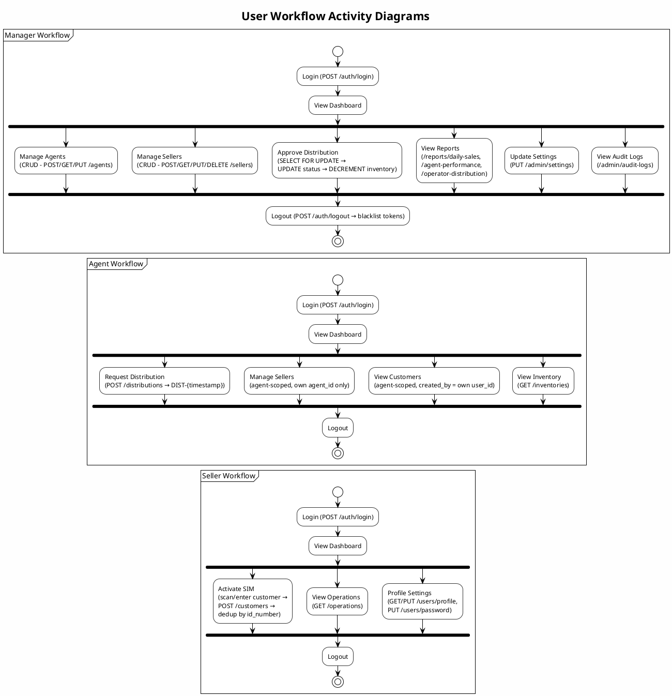

---

## Phase 8: API Flow Sequence Diagrams

### Mermaid Sequence Diagrams

#### a) SIM Activation Flow

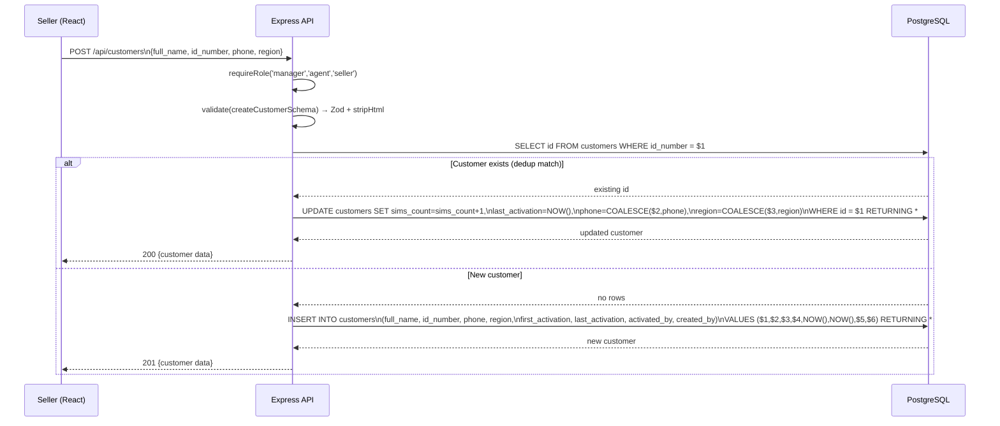

#### b) Distribution Request & Approval Flow

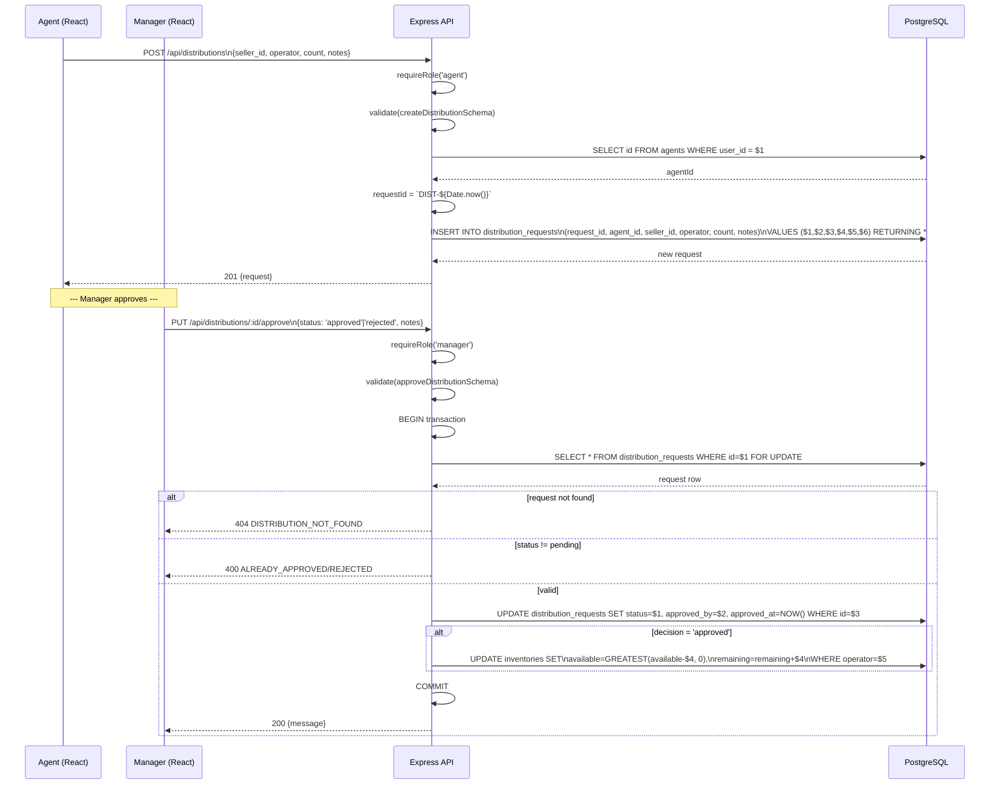

#### c) Agent Creation Flow

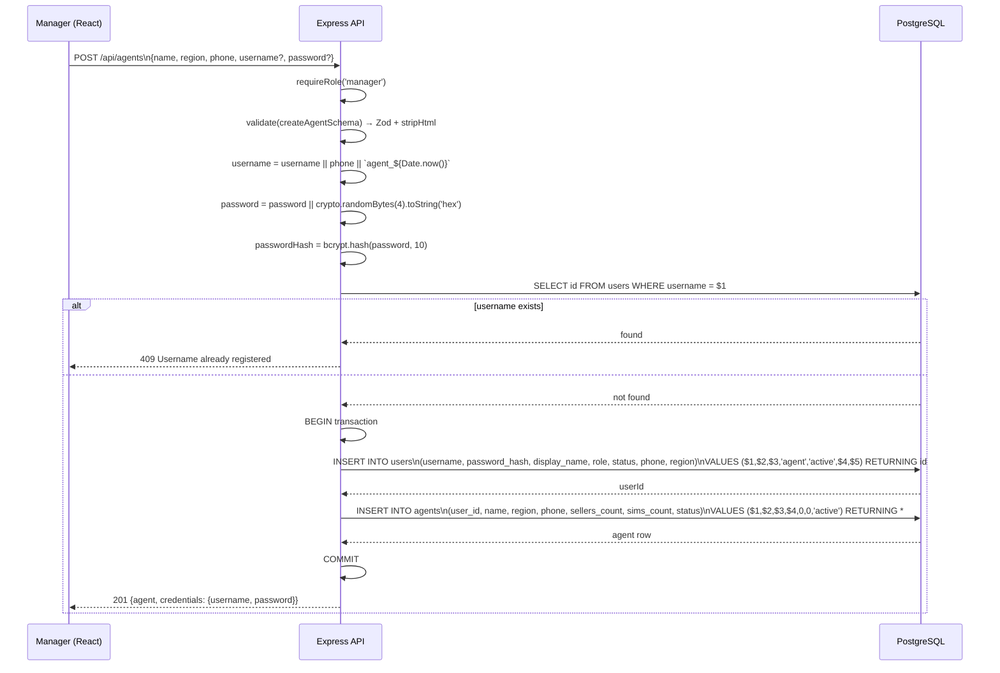

#### d) Seller Performance Report Flow

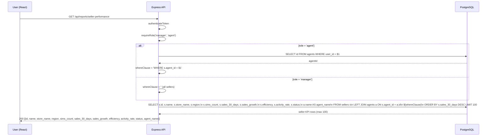

### PlantUML Sequence Diagrams

```plantuml
@startuml
!theme plain
skinparam backgroundColor #FEFEFE
skinparam sequenceMessageAlign center

title "Key API Flows"

'=== a) SIM Activation ===
partition "a) SIM Activation Flow" {
  actor Seller
  participant "Express API" as API
  database "PostgreSQL" as DB

  Seller -> API: POST /api/customers\n{full_name, id_number, phone, region}
  API -> API: authenticateToken + requireRole(manager,agent,seller)
  API -> API: validate(createCustomerSchema)
  API -> DB: SELECT id FROM customers WHERE id_number = $1
  alt existing customer
    DB --> API: found
    API -> DB: UPDATE customers SET\nsims_count=sims_count+1,\nlast_activation=NOW()\nWHERE id=$1 RETURNING *
    DB --> API: updated
    API --> Seller: 200 {customer}
  else new customer
    DB --> API: not found
    API -> DB: INSERT INTO customers (...) VALUES (...$1..$6) RETURNING *
    DB --> API: created
    API --> Seller: 201 {customer}
  end
}

'=== b) Distribution ===
partition "b) Distribution Request & Approval" {
  actor Agent
  actor Manager
  participant "Express API" as API2
  database "DB" as DB2

  Agent -> API2: POST /api/distributions\n{seller_id, operator, count}
  API2 -> DB2: SELECT id FROM agents WHERE user_id=$1
  DB2 --> API2: agentId
  API2 -> DB2: INSERT INTO distribution_requests\n(request_id, agent_id, seller_id,\noperator, count, notes)\nVALUES ('DIST-{ts}', $1, $2, $3, $4, $5) RETURNING *
  DB2 --> API2: request
  API2 --> Agent: 201

  Manager -> API2: PUT /api/distributions/:id/approve\n{status: 'approved'}
  API2 -> DB2: BEGIN
  API2 -> DB2: SELECT * FROM distribution_requests WHERE id=$1 FOR UPDATE
  DB2 --> API2: row
  API2 -> DB2: UPDATE distribution_requests\nSET status='approved', approved_by=$1, approved_at=NOW()
  API2 -> DB2: UPDATE inventories\nSET available=GREATEST(available-$2, 0),\nremaining=remaining+$2\nWHERE operator=$3
  API2 -> DB2: COMMIT
  API2 --> Manager: 200 {message}
}

'=== c) Agent Creation ===
partition "c) Agent Creation" {
  actor Manager2
  participant "Express API" as API3
  database "DB3" as DB3

  Manager2 -> API3: POST /api/agents\n{name, region, phone}
  API3 -> API3: crypto password → bcrypt hash
  API3 -> DB3: SELECT id FROM users WHERE username = $1
  DB3 --> API3: exists?
  API3 -> DB3: BEGIN
  API3 -> DB3: INSERT INTO users (username, password_hash,\ndisplay_name, role, status, phone, region)\nVALUES (...'agent','active'...) RETURNING id
  DB3 --> API3: userId
  API3 -> DB3: INSERT INTO agents (user_id, name, region,\nphone, sellers_count, sims_count, status)\nVALUES ($1,$2,$3,$4,0,0,'active') RETURNING *
  DB3 --> API3: agent
  API3 -> DB3: COMMIT
  API3 --> Manager2: 201 {agent, credentials {username, password}}
}

'=== d) Seller Performance ===
partition "d) Seller Performance Report" {
  actor User
  participant "Express API" as API4
  database "DB4" as DB4

  User -> API4: GET /api/reports/seller-performance
  API4 -> API4: requireRole(manager,agent)
  alt agent role
    API4 -> DB4: SELECT id FROM agents WHERE user_id=$1
    DB4 --> API4: agentId (scoped)
  end
  API4 -> DB4: SELECT s.*, a.name AS agent_name\nFROM sellers s\nLEFT JOIN agents a ON s.agent_id = a.id\n[WHERE s.agent_id=$1]\nORDER BY sales_30_days DESC LIMIT 100
  DB4 --> API4: rows
  API4 --> User: 200 [...seller KPIs...]
}

@enduml
```

---

## Phase 9: Deployment Architecture

### Mermaid Deployment Diagram

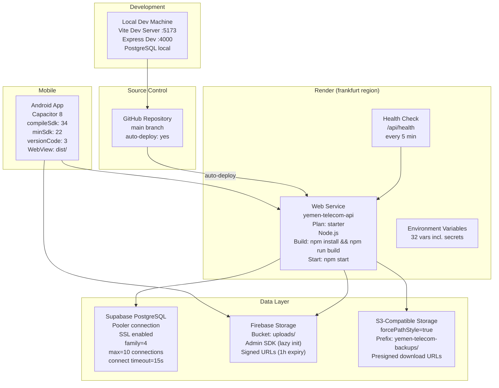

### PlantUML Deployment Diagram

```plantuml
@startuml
!theme plain
skinparam backgroundColor #FEFEFE
skinparam componentStyle rectangle

title "Deployment Architecture"

cloud "GitHub" {
  [Repository] as Repo
}

cloud "Render (frankfurt)" {
  node "Web Service" as Render {
    [Express API Server] as API
    [Static File Server] as Static
  }
  [Health Check /api/health] as HC
}

cloud "Supabase" {
  database "PostgreSQL" as PG {
    [pooler.url\nSSL, family=4\nmax=10, timeout=15s] as Pool
  }
}

cloud "Firebase" {
  storage "Storage Bucket" as FB {
    [uploads/ prefix\nSigned URLs 1h] as FBStorage
  }
}

cloud "S3-Compatible" {
  storage "Backup Bucket" as S3B {
    [yemen-telecom-backups/\npresigned URLs] as S3Store
  }
}

actor "Android App\n(Capacitor 8)" as Android
actor "Browser\n(React SPA Vite)" as Browser

Android --> Render : HTTPS\n(allowNavigation: render.com)
Android --> FB : direct SDK access
Browser --> Render : HTTPS
Browser --> HC : health check
Repo --> Render : auto-deploy on push

Render --> PG : pg Pool\nSSL connection
Render --> FB : Firebase Admin SDK\n(lazy init, \n replacement)
Render --> S3B : @aws-sdk/client-s3\nforcePathStyle

@enduml
```

---

## Phase 10: Firebase Architecture

### Mermaid Flow

```mermaid
flowchart LR
    subgraph "Client"
        C["React App / Android"]
    end

    subgraph "Upload Flow"
        direction TB
        U1["POST /api/upload/image\n(multipart/form-data)\nrequireRole(manager,agent)"]
        U2["multer.memoryStorage()\nfileFilter: ext + MIME check\njpeg|jpg|png|gif|webp\nmaxSize: 5MB"]
        U3["Magic Byte Validation\nJPEG: FF D8 FF\nPNG: 89 50 4E 47\nGIF: 47 49 46 38\nWEBP: RIFF....WEBP"]
        U4["Firebase Admin SDK\n(lazy init via getFirebaseAdmin())"]
        U5["private_key replace\n\\\\n → \\n"]
        U6["bucket.file('uploads/{filename}')\ncreateWriteStream({contentType})"]
        U7["getSignedUrl\naction: 'read'\nexpires: 1h"]
    end

    subgraph "Batch Upload"
        B1["POST /api/upload/images\n(multipart, array max 5)"]
        B2["Batch magic validation\n(loop over all files)"]
        B3["Promise.all\n(parallel upload to Firebase)"]
    end

    C --> U1
    U1 --> U2 --> U3 --> U4
    U4 --> U5 --> U6 --> U7
    U7 --> C

    C --> B1
    B1 --> B2 --> B3
    B3 --> C

    style U4 fill:#ea6100,color:#fff
    style U6 fill:#ea6100,color:#fff
```

### PlantUML Component Diagram

```plantuml
@startuml
!theme plain
skinparam backgroundColor #FEFEFE
skinparam componentStyle rectangle

title "Firebase Upload Architecture"

package "Client" {
  [React SPA App] as Client
}

package "Express API" {
  [upload.ts] as UploadRouter

  package "Middleware" {
    [requireRole(manager,agent)] as RBAC
    [multer: memoryStorage, 5MB]\nas UploadMWS
    [fileFilter: ext + MIME] as FileFilter
    [Magic Byte Validation] as Magic
  }

  package "Firebase Module" {
    [firebase-admin.ts] as FBModule
    [getFirebaseAdmin()] as Init
    [getBucket()] as GetBucket

    note right of Init
      Lazy initialization
      private_key.replace(/\\\\n/g, '\\n')
      Credentials: FIREBASE_PROJECT_ID
      FIREBASE_PRIVATE_KEY
      FIREBASE_CLIENT_EMAIL
    end note
  }

  [uploadToFirebase()] as UploadFn

  note right of UploadFn
    filename: {ts}-{random}.{ext}
    path: uploads/{filename}
    metadata: contentType
    getSignedUrl: 1h expiry
  end note
}

package "Firebase Cloud" {
  [Firebase Storage] as FBStorage
  [Bucket: uploads/] as FBBucket
}

Client -> UploadRouter : POST /api/upload/image (single)\nPOST /api/upload/images (array, max 5)
UploadRouter -> RBAC
RBAC -> UploadMWS
UploadMWS -> FileFilter
FileFilter -> Magic
Magic -> UploadFn
UploadFn -> Init : getFirebaseAdmin()
Init -> GetBucket : storage().bucket()
UploadFn -> FBBucket : blob.createWriteStream()
FBBucket --> UploadFn : on('finish')
UploadFn -> UploadFn : getSignedUrl(1h)
UploadFn --> Client : { url, filename }

@enduml
```

---

## Phase 11: Security Architecture

### Mermaid Security Stack Diagram

```mermaid
flowchart LR
    subgraph "Inbound HTTP Request"
        REQ["HTTP Request\nfrom Browser/Android"]
    end

    subgraph "Layer 1: Rate Limiting (4 tiers)"
        RL1["Global API\n100 requests/min\napplied via '/api'"]
        RL2["Auth Login\n10 requests/15min\napplied via '/api/auth/login'"]
        RL3["Auth Refresh\n20 requests/15min\napplied via '/api/auth/refresh'"]
        RL4["Write Operations\n30 requests/min\napplied to POST/PUT/DELETE"]
    end

    subgraph "Layer 2: CORS"
        CORS["cors() middleware\ndynamic origin checking\ncredentials: true\nCORS_ORIGIN env\nCapacitor origins allowed\nDev: all origins"]
    end

    subgraph "Layer 3: Helmet"
        HELM["helmet() middleware"]
        CSP["CSP:\ndefault-src 'self'\nconnect-src render.com\nfirebaseapp.com supabase.co\nimg-src 'self' data:\nfirebasestorage.googleapis.com\nscript-src 'self' 'unsafe-inline'\nstyle-src 'self' 'unsafe-inline'"]
        CLICK["frameguard: 'DENY'"]
        XSS["xssFilter"]
        NOSNIFF["noSniff"]
    end

    subgraph "Layer 4: CSRF (Double-Submit)"
        CSRF1["GET /api/csrf-token\nrandomBytes(32)\nHMAC-SHA256(csrf_secret, token)"]
        CSRF2["POST|PUT|DELETE check:\nx-csrf-token header\nx-csrf-hash header\ncrypto.timingSafeEqual\nHMAC-SHA256 validation"]
    end

    subgraph "Layer 5: JWT Authentication"
        JWT1["authenticateToken middleware\n(applied to all /api except /auth)"]
        JWT2["jwt.verify(token, JWT_SECRET)\nalgorithm: HS256\nissuer: 'yemen-telecom'\nexpiresIn: 1h access / 7d refresh"]
        JWT3["Blacklist Check\nSHA-256(token) → DB query\ntoken_blacklist table"]
        JWT4["Account Active Check\nSELECT status FROM users\nWHERE id = decoded.id"]
        JWT5["Maintenance Mode Check\nblock mutations when\nmaintenance_mode=TRUE"]
    end

    subgraph "Layer 6: RBAC"
        RBAC["requireRole() middleware\napplied per-route\n'manager' | 'agent' | 'seller'\nrole-based query scoping"]
    end

    subgraph "Layer 7: Input Validation"
        ZOD["Zod schemas\n(stripHtml on strings)\npassword complexity\noperator normalization\nenum validation"]
    end

    subgraph "Layer 8: Business Logic"
        BIZ["Route handlers\ntransaction() for atomic ops\nCOALESCE merge for updates\nSELECT FOR UPDATE for distribution"]
    end

    subgraph "Layer 9: Upload Security"
        UP1["multer:\nmemoryStorage\n5MB limit"]
        UP2["fileFilter:\nextension whitelist\n(jpeg,jpg,png,gif,webp)\nMIME type check"]
        UP3["Magic Bytes:\nJPEG: FF D8 FF\nPNG: 89 50 4E 47\nGIF: 47 49 46 38\nWEBP: RIFF....WEBP"]
    end

    subgraph "Layer 10: Backup Download"
        BK1["path.basename() only"]
        BK2["Reject if: filename != basename\nincludes '..'\nincludes '/' or '\\\\'"]
        BK3["Redirect to S3 presigned URL"]
    end

    REQ --> RL1
    RL1 --> RL2
    RL1 --> RL3
    RL1 --> RL4
    RL4 --> CORS
    CORS --> HELM
    HELM --> CSP
    HELM --> CLICK
    HELM --> XSS
    HELM --> NOSNIFF
    HELM --> CSRF1
    CSRF1 --> CSRF2
    CSRF2 --> JWT1
    JWT1 --> JWT2 --> JWT3 --> JWT4 --> JWT5
    JWT5 --> RBAC
    RBAC --> ZOD
    ZOD --> BIZ
    BIZ --> UP1
    UP1 --> UP2 --> UP3
    BIZ --> BK1 --> BK2 --> BK3
```

### PlantUML Security Component Diagram

```plantuml
@startuml
!theme plain
skinparam componentStyle rectangle
skinparam backgroundColor #FEFEFE

title "Security Architecture - Defense in Depth"

node "HTTP Request" as In

package "Layer 1: Rate Limiting" {
  [Global: 100/min] as RL1
  [Auth Login: 10/15min] as RL2
  [Auth Refresh: 20/15min] as RL3
  [Write Ops: 30/min] as RL4
}

package "Layer 2: CORS" {
  [cors() dynamic origin] as CORS
}

package "Layer 3: Helmet" {
  [CSP] as CSP
  [frameguard] as FRAME
  [xssFilter] as XSS
  [noSniff] as NOSNIFF
}

package "Layer 4: CSRF" {
  [GET /csrf-token] as CSRFToken
  [HMAC-SHA256 validation] as CSRFVal
}

package "Layer 5: JWT Auth" {
  [authenticateToken] as JWTAuth
  [HS256 verify] as JWTVerify
  [token_blacklist check] as JWTBlack
  [Account active check] as JWTAcct
  [Maintenance mode] as JWTMaint
}

package "Layer 6: RBAC" {
  [requireRole(manager,agent,seller)] as RBAC
}

package "Layer 7: Validation" {
  [Zod schemas + stripHtml] as ZOD
}

package "Layer 8: Business Logic" {
  [Route Handlers] as BIZ
  [DB transactions] as TX
}

package "Layer 9: Upload" {
  [multer 5MB limit] as MULTER
  [ext + MIME filter] as MIMEF
  [Magic byte validation] as MAGIC
}

package "Layer 10: Backup" {
  [basename + path guard] as PATH
  [S3 presigned redirect] as S3URL
}

In --> RL1
RL1 --> RL2
RL1 --> RL3
RL1 --> RL4
RL4 --> CORS
CORS --> CSP
CSP --> FRAME
FRAME --> XSS
XSS --> NOSNIFF
NOSNIFF --> CSRFToken
CSRFToken --> CSRFVal
CSRFVal --> JWTAuth
JWTAuth --> JWTVerify
JWTVerify --> JWTBlack
JWTBlack --> JWTAcct
JWTAcct --> JWTMaint
JWTMaint --> RBAC
RBAC --> ZOD
ZOD --> BIZ
BIZ --> TX
BIZ --> MULTER
MULTER --> MIMEF
MIMEF --> MAGIC
BIZ --> PATH
PATH --> S3URL

@enduml
```

---

## Phase 12: State Diagrams

### Mermaid State Diagrams

```mermaid
stateDiagram-v2
    state "SIM Lifecycle" as SIM {
        [*] --> available: SIM Created (POST /sims)
        available --> assigned: Assigned to Seller (PUT /sims with assigned_to)
        assigned --> activated: Customer Activation (POST /customers)
        activated --> suspended: Suspended by Manager (PUT /sims status=suspended)
        suspended --> available: Reassigned to Main Center (PUT /sims owner=المركز الرئيسي)
        available --> sold: Direct Sale (status=sold)
        sold --> available: Returned to Inventory
        reserved --> available: Release Reservation
        inactive --> available: Reactivated
    }

    state "Distribution Request Lifecycle" as DIST {
        [*] --> pending: Agent creates request (POST /distributions)
        pending --> approved: Manager approves (PUT /distributions/:id/approve)
        pending --> rejected: Manager rejects (PUT /distributions/:id/approve)
        approved --> [*]: SIMs distributed to seller
        rejected --> [*]: Request closed
    }

    state "User Account Lifecycle" as USER {
        [*] --> active: Account Created (registration)
        active --> inactive: Soft-deleted by Manager (PUT /users/account)
        active --> deleted: Full deactivation (DELETE /sellers/:id)
        inactive --> active: Reactivated by Manager
        deleted --> [*]: Cannot be reactivated
    }

    state "SIM Status Transitions" as SIMDETAIL {
        available --> available: Remains available
        available --> sold: Client bought (status='sold')
        available --> reserved: Reserved for client
        available --> inactive: Deactivated
        sold --> available: Returned
        reserved --> available: Released
        reserved --> sold: Sale completed
        inactive --> available: Reactivated
        inactive --> suspended: Suspended by admin
        suspended --> available: Un-suspended
    }
```

### PlantUML State Diagram

```plantuml
@startuml
!theme plain
skinparam backgroundColor #FEFEFE
skinparam stateBorderColor #333333

title "State Diagrams"

' === SIM Lifecycle ===
state "SIM Lifecycle" as SIM {
  [*] --> Available : SIM Created
  Available --> Assigned : assigned_to set
  Assigned --> Activated : POST /customers activation
  Activated --> Suspended : admin suspend
  Suspended --> Available : reassign to main center
  Available --> Sold : direct sale
  Sold --> Available : returned
  Available --> Reserved : reserved
  Reserved --> Available : released
  Reserved --> Sold : sale completed
  Inactive --> Available : reactivated
}

state "SIM Status Values" as SIMSTATES {
  state available : Default on create
  state sold : Client purchased
  state reserved : Held for client
  state inactive : Deactivated
  state suspended : Admin suspension
}

' === Distribution Request ===
state "Distribution Request Lifecycle" as DIST {
  [*] --> Pending : Agent POST /distributions
  Pending --> Approved : Manager PUT /approve {status: approved}
  Pending --> Rejected : Manager PUT /approve {status: rejected}
  Approved --> [*] : SIMs decremented from inventory
  Rejected --> [*] : Request closed
}

' === User Account ===
state "User Account Lifecycle" as USER {
  [*] --> Active : Registration
  Active --> Inactive : soft-delete (status='inactive')
  Active --> Deleted : DELETE /sellers/:id (status='deleted')
  Inactive --> Active : reactivated
  Deleted --> [*] : Terminal state
}

state "Account Status Values" as ACCTSTATES {
  state active : Normal operation
  state inactive : Temporarily disabled
  state deleted : Permanently disabled, username scrambled
}

@enduml
```

---

## Phase 13: Package/Module Diagrams

### Mermaid Package Structure Graph

```mermaid
graph TB
    subgraph "Project Root"
        CFG_R["render.yaml"]
        CFG_C["capacitor.config.ts"]
        CFG_V["vite.config.ts"]
        CFG_T["tsconfig.json"]
        CFG_D["Dockerfile"]
        CFG_E[".env"]
        CFG_G[".gitignore"]
        PKG["package.json"]
    end

    subgraph "src/ (Frontend - React SPA)"
        FE_MAIN["main.tsx"]
        FE_APP["App.tsx"]
        FE_TYPES["types.ts"]

        subgraph "src/api/"
            FE_API["client.ts\nHTTP client, CSRF, JWT refresh\nAbortController timeout"]
        end

        subgraph "src/hooks/"
            FE_H_AUTH["useAuth.ts\ntoken persistence, auto-login"]
            FE_H_MGR["useManagerState.ts\nmanager data fetching"]
            FE_H_AGT["useAgentSellerState.ts\nagent/seller state"]
            FE_H_OCR["useOcr.ts\nTesseract.js OCR\nBlur detection\nOtsu binarization"]
            FE_H_NET["useNetworkStatus.ts"]
            FE_H_DEB["useDebounce.ts"]
            FE_H_MNT["useMountedRef.ts"]
        end

        subgraph "src/lib/"
            FE_L_MON["monitor.ts\nring buffer, redaction"]
            FE_L_SAFE["safe.ts"]
            FE_L_ERR["getErrorMessage.ts"]
        end

        subgraph "src/services/"
            FE_S_TOK["tokenStorage.ts"]
        end

        subgraph "src/components/"
            FE_C_SPLASH["SplashScreen.tsx"]
            FE_C_LOGIN["LoginScreen.tsx"]
            FE_C_DASH["DashboardView.tsx"]
            FE_C_SIMS["SIMsView.tsx"]
            FE_C_AGENTS["AgentsView.tsx"]
            FE_C_SELLERS["SellersView.tsx"]
            FE_C_ALERTS["AlertsView.tsx"]
            FE_C_GEO["GeographicRiskView.tsx"]
            FE_C_REPORTS["ReportsView.tsx"]
            FE_C_SETTINGS["SettingsView.tsx"]
            FE_C_ADDAGT["AddAgentView.tsx"]
            FE_C_ADDSELL["AddSellerForm.tsx"]
            FE_C_ACTIVATE["ActivateSimForm.tsx"]
            FE_C_AGTDASH["AgentDashboard.tsx"]
            FE_C_AGTPROF["AgentProfileView.tsx"]
            FE_C_SLRDASH["SellerDashboard.tsx"]
            FE_C_TOPBAR["TopBar.tsx"]
            FE_C_NAVBAR["NavBar.tsx"]
            FE_C_BOTTOM["BottomNav.tsx"]
            FE_C_SHARED["shared/ErrorBoundary.tsx\nshared/LoadingScreen.tsx"]
        end

        subgraph "src/__tests__/"
            FE_T_AUTH["auth.test.ts"]
            FE_T_CSRF["csrf.test.ts"]
            FE_T_OCR["ocr.test.ts"]
            FE_T_SELLER["seller.test.ts"]
            FE_T_SIM["simActivation.test.ts"]
            FE_T_TOKEN["token-storage-regression.test.ts"]
            FE_T_CAMERA["camera-preview.test.ts"]
            FE_T_DUP["duplicate-api-calls.test.ts"]
            FE_T_SETUP["setup.ts"]
        end
    end

    subgraph "server/src/ (Backend - Express API)"
        BE_INDEX["index.ts\nmiddleware setup, route mounting\nstats cache, token cleanup"]
        BE_DB["db.ts\npg Pool config\nquery() + transaction()"]
        BE_VAL["validation.ts\nZod schemas, stripHtml\noperator normalization"]
        BE_HELP["helpers.ts\npagination"]
        BE_FIRE["firebase-admin.ts\nlazy Firebase Admin init"]
        BE_BACKUP["backup-storage.ts\nS3 client, presigned URLs"]
        BE_SEED["seed.ts"]
        BE_INIT["init-db.ts"]

        subgraph "server/src/middleware/"
            BE_MW["auth.ts\nJWT verify, blacklist check\nrequireRole()\nhashToken()"]
        end

        subgraph "server/src/routes/"
            BE_R_AUTH["auth.ts\nlogin, refresh, logout, /me"]
            BE_R_USERS["users.ts\npassword, profile, account delete"]
            BE_R_AGENTS["agents.ts\nCRUD (manager only)"]
            BE_R_SELLERS["sellers.ts\nCRUD + balance + reset password"]
            BE_R_SIMS["sims.ts\nCRUD (manager creates)"]
            BE_R_CUSTOMERS["customers.ts\nCRUD + dedup + search"]
            BE_R_OPS["operations.ts\nlist + create"]
            BE_R_INV["inventories.ts\nlist + batch update"]
            BE_R_ALERTS["alerts.ts\nlist + delete"]
            BE_R_DIST["distributions.ts\ncreate + approve (transactional)"]
            BE_R_REPORTS["reports.ts\ndaily sales, agent perf\noperator dist, seller perf"]
            BE_R_ADMIN["admin.ts\nsettings, transactions, audit\nbackup, lockdown, duplicates"]
            BE_R_UPLOAD["upload.ts\nmulter + magic bytes + Firebase"]
        end

        subgraph "server/migrations/"
            BE_M1["001_performance_indexes.sql"]
            BE_M2["002_foreign_key_cascades.sql"]
            BE_M3["003_token_blacklist_user_id.sql"]
            BE_M4["004_agent_phone_unique.sql"]
            BE_M5["005_schema_migrations_tracking.sql"]
        end

        subgraph "server/src/__tests__/"
            BE_T_AUTH["server-auth.test.ts"]
            BE_T_INT["auth-integration.test.ts"]
            BE_T_VAL["validation.test.ts"]
            BE_T_IDOR["sellers-idor-security.test.ts"]
            BE_T_CRED["hardcoded-credentials.test.ts"]
            BE_T_STATUS["auth-status-security.test.ts"]
        end
    end

    subgraph "android/"
        AND_BUILD["build.gradle\ncompileSdk 34\nminSdk 22\nversionCode 3"]
        AND_MAN["AndroidManifest.xml"]
        AND_CAP["app/src/main/assets/capacitor.config.json"]
    end

    FE_MAIN --> FE_APP
    FE_APP --> FE_TYPES
    FE_APP --> FE_API
    FE_APP --> FE_H_AUTH
    FE_APP --> FE_H_MGR
    FE_APP --> FE_H_AGT
    FE_APP --> FE_H_NET
    FE_APP --> FE_H_OCR
    FE_H_AUTH --> FE_S_TOK
    FE_H_AUTH --> FE_API
    FE_H_MGR --> FE_API
    FE_H_AGT --> FE_API
    BE_INDEX --> BE_MW
    BE_INDEX --> BE_R_AUTH
    BE_INDEX --> BE_R_USERS
    BE_INDEX --> BE_R_AGENTS
    BE_INDEX --> BE_R_SELLERS
    BE_INDEX --> BE_R_SIMS
    BE_INDEX --> BE_R_CUSTOMERS
    BE_INDEX --> BE_R_OPS
    BE_INDEX --> BE_R_INV
    BE_INDEX --> BE_R_ALERTS
    BE_INDEX --> BE_R_DIST
    BE_INDEX --> BE_R_REPORTS
    BE_INDEX --> BE_R_ADMIN
    BE_INDEX --> BE_R_UPLOAD
    BE_INDEX --> BE_DB
    BE_INDEX --> BE_FIRE
    BE_INDEX --> BE_BACKUP
    BE_R_AUTH --> BE_DB
    BE_R_AUTH --> BE_MW
    BE_R_AUTH --> BE_VAL
    BE_R_AGENTS --> BE_DB
    BE_R_AGENTS --> BE_VAL
    BE_R_SELLERS --> BE_DB
    BE_R_SELLERS --> BE_VAL
    BE_R_CUSTOMERS --> BE_DB
    BE_R_CUSTOMERS --> BE_VAL
    BE_R_DIST --> BE_DB
    BE_R_DIST --> BE_VAL
    BE_R_UPLOAD --> BE_FIRE
    BE_R_ADMIN --> BE_DB
    BE_R_ADMIN --> BE_BACKUP
```

### PlantUML Package Diagram

```plantuml
@startuml
!theme plain
skinparam backgroundColor #FEFEFE
skinparam packageStyle rectangle

title "Package and Module Structure"

package "Frontend (src/)" {
  [main.tsx] as FMain
  [App.tsx] as FApp

  package "api" {
    [client.ts] as FClient
  }

  package "hooks" {
    [useAuth.ts] as FAuth
    [useManagerState.ts] as FMgr
    [useAgentSellerState.ts] as FAgent
    [useOcr.ts] as FOcr
    [useNetworkStatus.ts] as FNet
    [useDebounce.ts] as FDeb
    [useMountedRef.ts] as FMount
  }

  package "lib" {
    [monitor.ts] as FMon
    [safe.ts] as FSafe
    [getErrorMessage.ts] as FErr
  }

  package "services" {
    [tokenStorage.ts] as FTok
  }

  package "components" {
    [SplashScreen.tsx] as FSplash
    [LoginScreen.tsx] as FLogin
    [DashboardView.tsx] as FDash
    [SIMsView.tsx] as FSims
    [AgentsView.tsx] as FAgents
    [SellersView.tsx] as FSellers
    [AlertsView.tsx] as FAlerts
    [GeographicRiskView.tsx] as FGeo
    [ReportsView.tsx] as FReports
    [SettingsView.tsx] as FSettings
    [AddAgentView.tsx] as FAddA
    [AddSellerForm.tsx] as FAddS
    [ActivateSimForm.tsx] as FAct
    [AgentDashboard.tsx] as FAgtDb
    [AgentProfileView.tsx] as FAgtPr
    [SellerDashboard.tsx] as FSlrDb
    [TopBar.tsx] as FTop
    [NavBar.tsx] as FNav
    [BottomNav.tsx] as FBot
    [shared/...] as FShared
  }

  package "__tests__" {
    [auth.test.ts] as FTestA
    [csrf.test.ts] as FTestC
    [ocr.test.ts] as FTestO
    [seller.test.ts] as FTestS
    [simActivation.test.ts] as FTestSim
  }
}

package "Backend (server/src/)" {
  [index.ts] as BIdx
  [db.ts] as BDb
  [validation.ts] as BVal
  [helpers.ts] as BHelp
  [firebase-admin.ts] as BFire
  [backup-storage.ts] as BBackup
  [seed.ts] as BSeed
  [init-db.ts] as BInit

  package "middleware" {
    [auth.ts] as BMW
  }

  package "routes" {
    [auth.ts] as BRAuth
    [users.ts] as BRUsers
    [agents.ts] as BRAgents
    [sellers.ts] as BRSellers
    [sims.ts] as BRSims
    [customers.ts] as BRCust
    [operations.ts] as BROps
    [inventories.ts] as BRInv
    [alerts.ts] as BRAlerts
    [distributions.ts] as BRDist
    [reports.ts] as BRRep
    [admin.ts] as BRAdmin
    [upload.ts] as BRUpload
  }

  package "__tests__" {
    [server-auth.test.ts]
    [auth-integration.test.ts]
    [validation.test.ts]
    [sellers-idor-security.test.ts]
    [hardcoded-credentials.test.ts]
    [auth-status-security.test.ts]
  }

  package "migrations" {
    [001_performance_indexes.sql]
    [002_foreign_key_cascades.sql]
    [003_token_blacklist_user_id.sql]
    [004_agent_phone_unique.sql]
    [005_schema_migrations_tracking.sql]
  }
}

package "Config Files" {
  [render.yaml]
  [capacitor.config.ts]
  [vite.config.ts]
  [tsconfig.json]
  [package.json]
}

' Frontend deps
FApp --> FMain
FApp --> FAuth
FApp --> FMgr
FApp --> FAgent
FApp --> FClient
FAuth --> FTok
FAuth --> FClient
FMgr --> FClient
FAgent --> FClient
FApp --> FDash
FApp --> FSims
FApp --> FAgents
FApp --> FSellers
FApp --> FAlerts
FApp --> FReports
FApp --> FSettings
FApp --> FAddA
FApp --> FAddS
FApp --> FAct
FApp --> FAgtDb
FApp --> FSlrDb
FApp --> FTop
FApp --> FNav
FApp --> FBot

' Backend deps
BIdx --> BMW
BIdx --> BRAuth
BIdx --> BRUsers
BIdx --> BRAgents
BIdx --> BRSellers
BIdx --> BRSims
BIdx --> BRCust
BIdx --> BROps
BIdx --> BRInv
BIdx --> BRAlerts
BIdx --> BRDist
BIdx --> BRRep
BIdx --> BRAdmin
BIdx --> BRUpload
BIdx --> BDb
BIdx --> BFire
BIdx --> BBackup

BRAuth --> BDb
BRAuth --> BMW
BRAuth --> BVal
BRAgents --> BDb
BRAgents --> BVal
BRSellers --> BDb
BRSellers --> BVal
BRDist --> BDb
BRDist --> BVal
BRUpload --> BFire
BRAdmin --> BDb
BRAdmin --> BBackup
BRCust --> BDb
BRCust --> BVal

@enduml
```

---

## Phase 14: Complete Data Flow Diagram

### Mermaid End-to-End Data Flow

```mermaid
flowchart LR
    subgraph "User Interaction"
        U["User\n(Manager/Agent/Seller)"]
        V["React Views\n<App/> renders"]
    end

    subgraph "State & Hooks"
        SA["useAuth()\ntoken lifecycle\nCSRF fetch"]
        SM["useManagerState()\n11 data fetches\nrefresh cycle"]
        SA2["useAgentSellerState()\nagent/seller data\nrole-scoped"]
    end

    subgraph "API Client Layer"
        AC["api/client.ts"]
        CSRF["CSRF double-submit\nx-csrf-token + x-csrf-hash\nHMAC-SHA256"]
        JWT["Bearer token\nAuthorization header\nJWT refresh rotation"]
        TIMEO["AbortController\n15s timeout"]
        DEDUP["Request dedup\n429 guard"]
    end

    subgraph "Express Middleware Stack"
        RL["Rate Limiter\n100/10/30/20 limits"]
        CORS["CORS\ndynamic origin"]
        HEL["Helmet\nCSP + XSS + clickjack"]
        CSRFV["CSRF Validation\ntimingSafeEqual\nHMAC-SHA256"]
        JWT_A["authenticateToken\nJWT verify\nblacklist check\naccount check"]
        MAINT["Maintenance Mode\nblock mutations"]
        RBAC["requireRole\nmanager/agent/seller"]
    end

    subgraph "Route Handlers"
        RH["Route Handler\n(13 route files)"]
        ZOD["Zod Validation\nstripHtml\noperator norm"]
    end

    subgraph "Data Access"
        DB_q["query()\npg Pool\nslow query log"]
        DB_tx["transaction()\nBEGIN/COMMIT/ROLLBACK\nSELECT FOR UPDATE"]
    end

    subgraph "External Services"
        PG["PostgreSQL\n14 tables\n35+ indexes"]
        FB_u["Firebase Storage\nuploads/ bucket\nsigned URLs (1h)"]
        S3_b["S3 Backup\nforcePathStyle\npresigned URLs"]
    end

    subgraph "Response Pipeline"
        RESP["JSON Response"]
        RENDER["React State Update\n→ UI Re-render"]
    end

    U --> V
    V --> SA
    V --> SM
    V --> SA2
    SA --> AC
    SM --> AC
    SA2 --> AC

    AC --> CSRF
    AC --> JWT
    AC --> TIMEO
    AC --> DEDUP

    AC --> RL --> CORS --> HEL --> CSRFV --> JWT_A --> MAINT --> RBAC

    RBAC --> RH
    RH --> ZOD
    ZOD --> DB_q
    ZOD --> DB_tx

    DB_q --> PG
    DB_tx --> PG

    RH --> FB_u
    RH --> S3_b

    PG --> RESP
    FB_u --> RESP
    S3_b --> RESP

    RESP --> RENDER
    RENDER --> V
```

### PlantUML Data Flow Diagram

```plantuml
@startuml
!theme plain
skinparam backgroundColor #FEFEFE
skinparam componentStyle rectangle

title "Complete End-to-End Data Flow"

actor "User" as User

package "Frontend" {
  [React App (App.tsx)] as React
  [useAuth()] as SAuth
  [useManagerState()] as SMgr
  [useAgentSellerState()] as SAgt
  [api/client.ts] as APIClient
  [CSRF + JWT Prep] as TokenPrep

  React --> SAuth
  React --> SMgr
  React --> SAgt
  SAuth --> APIClient
  SMgr --> APIClient
  SAgt --> APIClient
  APIClient --> TokenPrep
}

User --> React : click / input / scroll

package "Express Backend" {
  [Rate Limiter] as RL
  [CORS] as CORS
  [Helmet] as Helmet
  [CSRF Validation] as CSRFVal
  [JWT Authenticate] as JWTAuth
  [Maintenance Mode] as Maint
  [RBAC requireRole] as RBAC
  [Zod Validation] as Zod
  [Route Handler] as Handler

  RL --> CORS
  CORS --> Helmet
  Helmet --> CSRFVal
  CSRFVal --> JWTAuth
  JWTAuth --> Maint
  Maint --> RBAC
  RBAC --> Zod
  Zod --> Handler
}

APIClient --> RL : HTTPS request\n(with CSRF header + Bearer JWT)

database "PostgreSQL\n(14 tables)" as PG
storage "Firebase Storage\n(uploads/)" as FB
storage "S3 Backup\n(backups/)" as S3

Handler --> PG : query() / transaction()
Handler --> FB : Firebase Admin SDK
Handler --> S3 : @aws-sdk/client-s3

PG --> Handler : rows / results
FB --> Handler : signed URLs
S3 --> Handler : presigned URLs

Handler --> APIClient : JSON response
APIClient --> React : parsed data
React --> User : updated UI / charts / tables

@enduml
```

---

## Appendix A: Route Inventory

| # | File | Route Prefix | Role | Endpoints |
|---|------|-------------|------|-----------|
| 1 | auth.ts | /api/auth | Public (except /me) | POST /login, POST /refresh, POST /logout, GET /me |
| 2 | users.ts | /api/users | Authenticated | PUT /password, PUT /profile, DELETE /account |
| 3 | agents.ts | /api/agents | Manager (GET manager+agent) | GET /, POST /, PUT /:id |
| 4 | sellers.ts | /api/sellers | Manager+Agent | GET /, POST /, PUT /:id, PUT /:id/balance, POST /:id/reset-password, DELETE /:id |
| 5 | sims.ts | /api/sims | Manager+Agent | GET /, POST / (manager), PUT /:id (manager), DELETE /:id (manager) |
| 6 | customers.ts | /api/customers | Manager+Agent+Seller | GET / (mgr+agt), GET /search (mgr+agt), GET /:id (mgr+agt+slr), POST / (all) |
| 7 | operations.ts | /api/operations | Manager+Agent | GET /, POST / |
| 8 | inventories.ts | /api/inventories | Manager+Agent | GET /, PUT / (manager batch update) |
| 9 | alerts.ts | /api/alerts | Manager | GET / (manager), DELETE /:id (manager) |
| 10 | distributions.ts | /api/distributions | Manager+Agent | GET /, POST / (agent), PUT /:id/approve (manager), GET /pending-count (manager) |
| 11 | reports.ts | /api/reports | Manager+Agent | GET /daily-sales (mgr), GET /agent-performance (mgr), GET /operator-distribution (mgr), GET /seller-performance (mgr+agt) |
| 12 | admin.ts | /api/admin | Manager | GET /settings, PUT /settings, GET /transactions, GET /duplicate-identities, GET /audit-logs, POST /system/backup, GET /system/backup/download/:filename, POST /system/lockdown, GET /system/lockdown/status |
| 13 | upload.ts | /api/upload | Manager+Agent | POST /image, POST /images (batch 5) |

## Appendix B: Environment Variables

| Category | Variable | Source |
|----------|----------|--------|
| Node | NODE_ENV, PORT, API_PORT | render.yaml |
| Database | DB_HOST, DB_PORT, DB_USER, DB_PASSWORD, DB_NAME, DB_SSL_REJECT_UNAUTHORIZED, DB_SSL_CA_CERT, DB_FAMILY, DB_MAX_CONNECTIONS, DB_SLOW_QUERY_MS | render.yaml |
| Auth | JWT_SECRET, REFRESH_SECRET, CSRF_SECRET, CORS_ORIGIN | render.yaml |
| Firebase | FIREBASE_PROJECT_ID, FIREBASE_PRIVATE_KEY, FIREBASE_CLIENT_EMAIL, FIREBASE_STORAGE_BUCKET, FIREBASE_PRIVATE_KEY_ID, FIREBASE_CLIENT_ID, FIREBASE_CLIENT_CERT_URL | render.yaml |
| Backup S3 | BACKUP_S3_ENDPOINT, BACKUP_S3_REGION, BACKUP_S3_ACCESS_KEY_ID, BACKUP_S3_SECRET_ACCESS_KEY, BACKUP_S3_BUCKET | render.yaml |

## Appendix C: Database Indexes Summary

| Table | Indexes |
|-------|---------|
| users | idx_users_role(role), idx_users_username(username), (status), (phone), (role,username) |
| agents | idx_agents_user_id(user_id), idx_agents_name(name), (status), (region) |
| sellers | idx_sellers_agent_id(agent_id), idx_sellers_user_id(user_id), idx_sellers_agent_name(agent_name), idx_sellers_phone(phone), idx_sellers_status(status), (region), (region_code), (id_number), (created_at) |
| sims | idx_sims_iccid(iccid), idx_sims_provider(provider), idx_sims_status(status), idx_sims_assigned_to(assigned_to), (phone), (owner), (customer_name), (customer_id), (created_at), (provider,status) |
| customers | idx_customers_id_number(id_number), idx_customers_phone(phone), idx_customers_name(full_name) |
| operations | idx_operations_type(type), (status), (target), (operator), (customer_name), (customer_id), (created_at), (type,status) |
| inventories | (available) |
| alerts | idx_alerts_read(is_read), (priority), (category), (time), (is_read,priority,time) |
| distribution_requests | idx_distribution_status(status), idx_distribution_agent(agent_id), (seller_id), (created_at) |
| transactions | (status), (provider), (client_name) |
| audit_logs | idx_audit_logs_type(type), (status), (username), (time) |
| duplicate_identities | idx_duplicate_identities_region(region), (risk), (name) |
| token_blacklist | idx_token_blacklist_user_id(user_id), idx_token_blacklist_expires(expires_at), idx_token_blacklist_expires_user(expires_at,user_id) |

## Appendix D: Migration History

| Migration | Purpose |
|-----------|---------|
| 001 | Performance indexes on all tables |
| 002 | FK columns with ON DELETE SET NULL (created_by, activated_by fields) |
| 003 | Add user_id column to token_blacklist + index |
| 004 | UNIQUE constraint on agents.phone (where non-empty) |
| 005 | Schema migration tracking table |

## Appendix E: Key Security Configurations

| Measure | Implementation |
|---------|---------------|
| JWT Algorithm | HS256 |
| Access Token Expiry | 1 hour |
| Refresh Token Expiry | 7 days |
| JWT Issuer | 'yemen-telecom' |
| CSRF Method | Double-submit (HMAC-SHA256) |
| CSRF Secret | CSRF_SECRET env var |
| Password Hashing | bcrypt, 10 rounds |
| Password Requirements | Min 8 chars, uppercase, lowercase, digit |
| Upload Limits | 5MB per file, max 5 files batch |
| Upload Extensions | jpeg, jpg, png, gif, webp |
| Magic Bytes | JPEG: FF D8 FF, PNG: 89 50 4E 47, GIF: 47 49 46 38, WEBP: RIFF....WEBP |
| Rate Limiting | Global 100/min, Auth login 10/15min, Refresh 20/15min, Write 30/min |
| CORS | Dynamic origin from CORS_ORIGIN env + Capacitor/localhost allowances |
| CSP | default-src 'self', connect-src limited, img-src 'self' data: blob: |
| DB SSL | rejectUnauthorized configurable (default true), CA cert support |
| Pool Size | max 10 connections |
| Connection Timeout | 15000ms |
| Slow Query Threshold | 500ms (configurable via DB_SLOW_QUERY_MS) |
| Token Cleanup | Hourly DELETE expired from token_blacklist |
| Backup Download | Path traversal guard (basename only, reject .. and /) |

---

*Generated from source code analysis. Ground truth: schema.sql, index.ts, 13 route files, middleware/auth.ts, db.ts, validation.ts, firebase-admin.ts, backup-storage.ts, App.tsx, api/client.ts, hooks/*, capacitor.config.ts, render.yaml.*
