# Yemen Telecom SIM Management System — System Model

> **Version**: 1.0.0  
> **Date**: 2026-06-27  
> **Source**: Reverse-engineered from source code at `server/src/`  
> **Scope**: Full architecture model covering domain, contexts, flows, authorization, integration, and data flow

---

## 1. Domain Model

### Mermaid Class Diagram

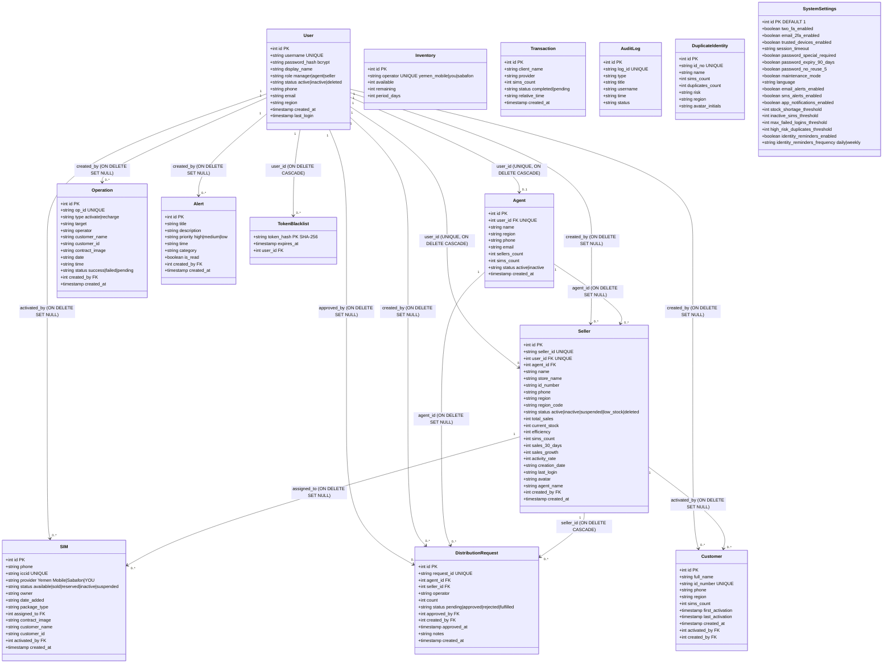

### PlantUML Class Diagram

```plantuml
@startuml
!theme plain
skinparam classFontSize 11
skinparam backgroundColor #FEFEFE
skinparam shadowing false
skinparam classBorderColor #333333

title Yemen Telecom — Domain Model

class User {
  + id: SERIAL PK
  + username: VARCHAR(100) UNIQUE NOT NULL
  + password_hash: VARCHAR(255) NOT NULL
  + display_name: VARCHAR(200) DEFAULT ''
  + role: VARCHAR(20) CHECK(manager|agent|seller)
  + status: VARCHAR(20) DEFAULT 'active'
  + phone: VARCHAR(50) DEFAULT ''
  + email: VARCHAR(200) DEFAULT ''
  + region: VARCHAR(200) DEFAULT ''
  + created_at: TIMESTAMP DEFAULT NOW()
  + last_login: TIMESTAMP
}

class Agent {
  + id: SERIAL PK
  + user_id: INTEGER UNIQUE FK
  + name: VARCHAR(200) NOT NULL
  + region: VARCHAR(200) DEFAULT ''
  + phone: VARCHAR(50) DEFAULT ''
  + email: VARCHAR(200) DEFAULT ''
  + sellers_count: INTEGER DEFAULT 0
  + sims_count: INTEGER DEFAULT 0
  + status: VARCHAR(20) DEFAULT 'active'
  + created_at: TIMESTAMP DEFAULT NOW()
}

class Seller {
  + id: SERIAL PK
  + seller_id: VARCHAR(50) UNIQUE NOT NULL
  + user_id: INTEGER UNIQUE FK
  + agent_id: INTEGER FK
  + name: VARCHAR(200) NOT NULL
  + store_name: VARCHAR(200) DEFAULT ''
  + id_number: VARCHAR(50) DEFAULT ''
  + phone: VARCHAR(50) DEFAULT ''
  + email: VARCHAR(200) DEFAULT ''
  + region: VARCHAR(200) DEFAULT ''
  + region_code: VARCHAR(50) DEFAULT ''
  + status: VARCHAR(20) DEFAULT 'active'
  + total_sales: INTEGER DEFAULT 0
  + current_stock: INTEGER DEFAULT 0
  + efficiency: INTEGER DEFAULT 0
  + sims_count: INTEGER DEFAULT 0
  + sales_30_days: INTEGER DEFAULT 0
  + sales_growth: INTEGER DEFAULT 0
  + activity_rate: INTEGER DEFAULT 0
  + creation_date: VARCHAR(20) DEFAULT ''
  + last_login: VARCHAR(100) DEFAULT ''
  + avatar: VARCHAR(500) DEFAULT ''
  + agent_name: VARCHAR(200) DEFAULT ''
  + created_by: INTEGER FK
  + created_at: TIMESTAMP DEFAULT NOW()
}

class SIM {
  + id: SERIAL PK
  + phone: VARCHAR(50) DEFAULT ''
  + iccid: VARCHAR(50) UNIQUE NOT NULL
  + provider: VARCHAR(50) DEFAULT 'Yemen Mobile'
  + status: VARCHAR(20) DEFAULT 'available'
  + owner: VARCHAR(200) DEFAULT 'المركز الرئيسي'
  + date_added: VARCHAR(20) DEFAULT ''
  + package_type: VARCHAR(100) DEFAULT 'باقة مزايا الشهرية'
  + assigned_to: INTEGER FK
  + contract_image: VARCHAR(500) DEFAULT ''
  + customer_name: VARCHAR(200) DEFAULT ''
  + customer_id: VARCHAR(50) DEFAULT ''
  + activated_by: INTEGER FK
  + created_at: TIMESTAMP DEFAULT NOW()
}

class Customer {
  + id: SERIAL PK
  + full_name: VARCHAR(200) NOT NULL
  + id_number: VARCHAR(50) UNIQUE NOT NULL
  + phone: VARCHAR(50) DEFAULT ''
  + region: VARCHAR(200) DEFAULT ''
  + sims_count: INTEGER DEFAULT 1
  + first_activation: TIMESTAMP DEFAULT NOW()
  + last_activation: TIMESTAMP DEFAULT NOW()
  + created_at: TIMESTAMP DEFAULT NOW()
  + activated_by: INTEGER FK
  + created_by: INTEGER FK
}

class Operation {
  + id: SERIAL PK
  + op_id: VARCHAR(100) UNIQUE NOT NULL
  + type: VARCHAR(20) CHECK(activate|recharge)
  + target: VARCHAR(100) DEFAULT ''
  + operator: VARCHAR(50) DEFAULT ''
  + customer_name: VARCHAR(200)
  + customer_id: VARCHAR(50)
  + contract_image: VARCHAR(500)
  + date: VARCHAR(20) DEFAULT ''
  + time: VARCHAR(50) DEFAULT ''
  + status: VARCHAR(20) DEFAULT 'success'
  + created_by: INTEGER FK
  + created_at: TIMESTAMP DEFAULT NOW()
}

class Inventory {
  + id: SERIAL PK
  + operator: VARCHAR(50) UNIQUE NOT NULL
  + available: INTEGER DEFAULT 0
  + remaining: INTEGER DEFAULT 0
  + period_days: INTEGER DEFAULT 0
}

class DistributionRequest {
  + id: SERIAL PK
  + request_id: VARCHAR(100) UNIQUE NOT NULL
  + agent_id: INTEGER FK
  + seller_id: INTEGER FK
  + operator: VARCHAR(50) NOT NULL
  + count: INTEGER NOT NULL
  + status: VARCHAR(20) DEFAULT 'pending'
  + notes: TEXT DEFAULT ''
  + approved_by: INTEGER FK
  + created_by: INTEGER FK
  + approved_at: TIMESTAMP
  + created_at: TIMESTAMP DEFAULT NOW()
}

class Alert {
  + id: SERIAL PK
  + title: VARCHAR(300) NOT NULL
  + description: TEXT DEFAULT ''
  + priority: VARCHAR(10) CHECK(high|medium|low)
  + time: VARCHAR(50) DEFAULT ''
  + category: VARCHAR(100) DEFAULT ''
  + is_read: BOOLEAN DEFAULT FALSE
  + created_by: INTEGER FK
  + created_at: TIMESTAMP DEFAULT NOW()
}

class Transaction {
  + id: SERIAL PK
  + client_name: VARCHAR(200) NOT NULL
  + provider: VARCHAR(50) DEFAULT 'Yemen Mobile'
  + sims_count: INTEGER DEFAULT 0
  + status: VARCHAR(20) DEFAULT 'completed'
  + relative_time: VARCHAR(50) DEFAULT ''
  + created_at: TIMESTAMP DEFAULT NOW()
}

class AuditLog {
  + id: SERIAL PK
  + log_id: VARCHAR(100) UNIQUE NOT NULL
  + type: VARCHAR(50) DEFAULT ''
  + title: VARCHAR(300) DEFAULT ''
  + username: VARCHAR(200) DEFAULT ''
  + time: VARCHAR(50) DEFAULT ''
  + status: VARCHAR(20) DEFAULT ''
}

class DuplicateIdentity {
  + id: SERIAL PK
  + id_no: VARCHAR(50) UNIQUE NOT NULL
  + name: VARCHAR(200) NOT NULL
  + sims_count: INTEGER DEFAULT 0
  + duplicates_count: INTEGER DEFAULT 0
  + risk: VARCHAR(50) DEFAULT ''
  + region: VARCHAR(200) DEFAULT ''
  + avatar_initials: VARCHAR(10) DEFAULT ''
}

class SystemSettings {
  + id: INTEGER PK DEFAULT 1
  + two_fa_enabled: BOOLEAN DEFAULT TRUE
  + email_2fa_enabled: BOOLEAN DEFAULT FALSE
  + trusted_devices_enabled: BOOLEAN DEFAULT TRUE
  + session_timeout: VARCHAR(50) DEFAULT '30 دقيقة'
  + password_special_required: BOOLEAN DEFAULT TRUE
  + password_expiry_90_days: BOOLEAN DEFAULT TRUE
  + password_no_reuse_5: BOOLEAN DEFAULT FALSE
  + maintenance_mode: BOOLEAN DEFAULT FALSE
  + language: VARCHAR(100) DEFAULT 'العربية (المملكة العربية السعودية)'
  + email_alerts_enabled: BOOLEAN DEFAULT TRUE
  + sms_alerts_enabled: BOOLEAN DEFAULT TRUE
  + app_notifications_enabled: BOOLEAN DEFAULT FALSE
  + stock_shortage_threshold: INTEGER DEFAULT 5
  + inactive_sims_threshold: INTEGER DEFAULT 90
  + max_failed_logins_threshold: INTEGER DEFAULT 3
  + high_risk_duplicates_threshold: INTEGER DEFAULT 5
  + identity_reminders_enabled: BOOLEAN DEFAULT TRUE
  + identity_reminders_frequency: VARCHAR(10) DEFAULT 'weekly'
}

class TokenBlacklist {
  + token_hash: VARCHAR(64) PK
  + expires_at: TIMESTAMP NOT NULL
  + user_id: INTEGER FK
}

' === RELATIONSHIPS ===

User  ||..o{ Agent              : "user_id (UNIQUE) ON DELETE CASCADE"
User  ||..o{ Seller             : "user_id (UNIQUE) ON DELETE CASCADE"
User  ||..o{ TokenBlacklist     : "user_id ON DELETE CASCADE"
User   }o..o{ Seller            : "created_by ON DELETE SET NULL"
User   }o..o{ SIM               : "activated_by ON DELETE SET NULL"
User   }o..o{ Operation         : "created_by ON DELETE SET NULL"
User   }o..o{ Alert             : "created_by ON DELETE SET NULL"
User   }o..o{ DistributionRequest : "approved_by ON DELETE SET NULL"
User   }o..o{ DistributionRequest : "created_by ON DELETE SET NULL"
User   }o..o{ Customer          : "created_by ON DELETE SET NULL"
Agent  ||..o{ Seller            : "agent_id ON DELETE SET NULL"
Agent   }o..o{ DistributionRequest : "agent_id ON DELETE SET NULL"
Seller  ||..o{ SIM              : "assigned_to ON DELETE SET NULL"
Seller  ||..o{ DistributionRequest : "seller_id ON DELETE CASCADE"
Seller  ||..o{ Customer         : "activated_by ON DELETE SET NULL"
@enduml
```

---

## 2. Bounded Contexts

| # | Context | Responsibility | Key Entities | Relationships | APIs |
|---|---------|---------------|-------------|---------------|------|
| 1 | **Auth** | JWT login, refresh, logout, /me, token blacklist | User, TokenBlacklist | Reads User for credentials/status, writes TokenBlacklist for revocation | `POST /login`, `POST /refresh`, `POST /logout`, `GET /me`, `GET /csrf-token` |
| 2 | **User Management** | CRUD for users, agents, sellers; password/profile management | User, Agent, Seller | Creates User+Agent/Seller in transactions; reads User for password changes | `POST/PUT /agents`, `GET/POST/PUT/DELETE /sellers`, `PUT /users/password`, `PUT /users/profile`, `DELETE /users/account` |
| 3 | **SIM Management** | SIM CRUD, lifecycle tracking (available→sold→reserved→inactive→suspended) | SIM | Assigns SIMs to Sellers; records activated_by User | `GET/POST/PUT/DELETE /sims` |
| 4 | **Inventory** | Stock tracking by telecom operator | Inventory | Decremented on distribution approval; read by agents and manager | `GET/PUT /inventories` |
| 5 | **Distribution** | Agent→Manager→Seller distribution request workflow | DistributionRequest, Inventory, Agent, Seller | Links Agent→DistributionRequest→Seller; on approval decrements Inventory | `GET/POST /distributions`, `PUT /distributions/:id/approve`, `GET /distributions/pending-count` |
| 6 | **Reporting** | Aggregated sales, performance, operator distribution queries | Operation, Seller, Agent, SIM | Reads across multiple tables with GROUP BY, JOIN, window functions | `GET /reports/daily-sales`, `GET /reports/agent-performance`, `GET /reports/operator-distribution`, `GET /reports/seller-performance` |
| 7 | **Alert** | System notification list/delete | Alert | Manager-only CRUD | `GET /alerts`, `DELETE /alerts/:id` |
| 8 | **Admin** | Settings, audit logs, transactions (read-only), duplicate identities, backup, lockdown | SystemSettings, AuditLog, Transaction, DuplicateIdentity, all 13 tables | Reads all tables for backup; writes SystemSettings and Seller status for lockdown | `GET/PUT /admin/settings`, `GET /admin/transactions`, `GET /admin/duplicate-identities`, `GET /admin/audit-logs`, `POST /admin/system/backup`, `POST /admin/system/lockdown` |
| 9 | **Upload** | Image upload to Firebase Storage with 3-layer validation | Firebase Storage | External: Firebase Storage bucket `uploads/` | `POST /upload/image`, `POST /upload/images` |

### Bounded Context Dependency Graph

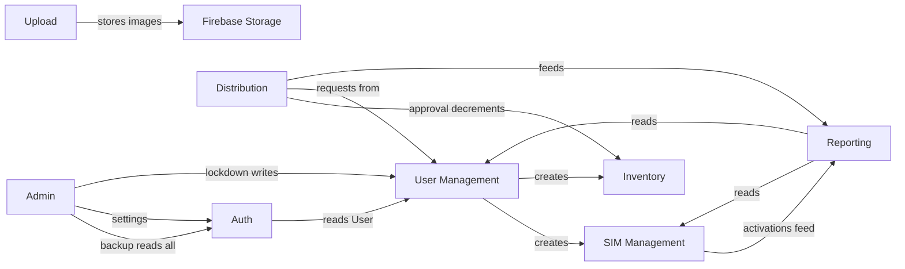

---

## 3. User Flows (Activity Diagrams)

### Manager Workflow

```mermaid
stateDiagram-v2
    [*] --> Login: Navigate to app
    Login --> Dashboard: POST /auth/login → JWT
    Dashboard --> ManageAgents: Select Agents
    ManageAgents --> CreateAgent: Click Add Agent
    CreateAgent --> Dashboard: Transaction: INSERT user + agent
    Dashboard --> ManageSellers: Select Sellers
    ManageSellers --> CreateSeller: Click Add Seller
    CreateSeller --> ManageSellers: Transaction: INSERT user + seller
    ManageSellers --> ResetSellerPassword: Reset password
    ResetSellerPassword --> ManageSellers: crypto → bcrypt → UPDATE users
    ManageSellers --> UpdateSellerBalance: Adjust balance
    UpdateSellerBalance --> ManageSellers: UPDATE sales_30_days
    Dashboard --> ApproveDistributions: Select Distributions
    ApproveDistributions --> ProcessApproval: Click Approve/Reject
    ProcessApproval --> ApproveDistributions: SELECT FOR UPDATE → UPDATE status → DECREMENT inventory
    Dashboard --> ViewReports: Select Reports
    ViewReports --> DailySales: Daily activations (30 days)
    ViewReports --> AgentPerformance: Agent aggregation
    ViewReports --> SellerPerformance: Top 100 sellers
    ViewReports --> OperatorDistribution: SIM + op distribution
    Dashboard --> ViewAlerts: Select Alerts
    ViewAlerts --> DeleteAlert: Resolve alert
    Dashboard --> ViewSettings: Select Settings
    ViewSettings --> UpdateSettings: 18 system fields
    Dashboard --> ViewDuplicateIdentities: Select Geographic Risk
    Dashboard --> EmergencyLockdown: Toggle lockdown
    EmergencyLockdown --> Dashboard: UPDATE system_settings + sellers
    Dashboard --> SystemBackup: Create backup
    SystemBackup --> Dashboard: 13 tables → JSON → S3
    Dashboard --> ViewAuditLogs: Select Audit Logs
    Dashboard --> Logout: Click logout
    Logout --> [*]: POST /logout → blacklist tokens
```

### Agent Workflow

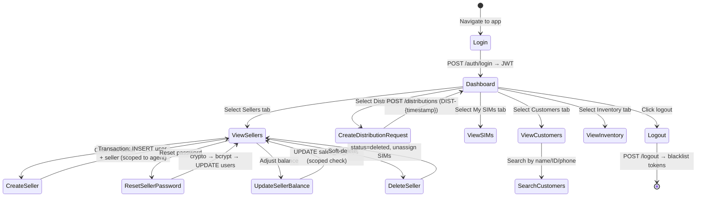

### Seller Workflow

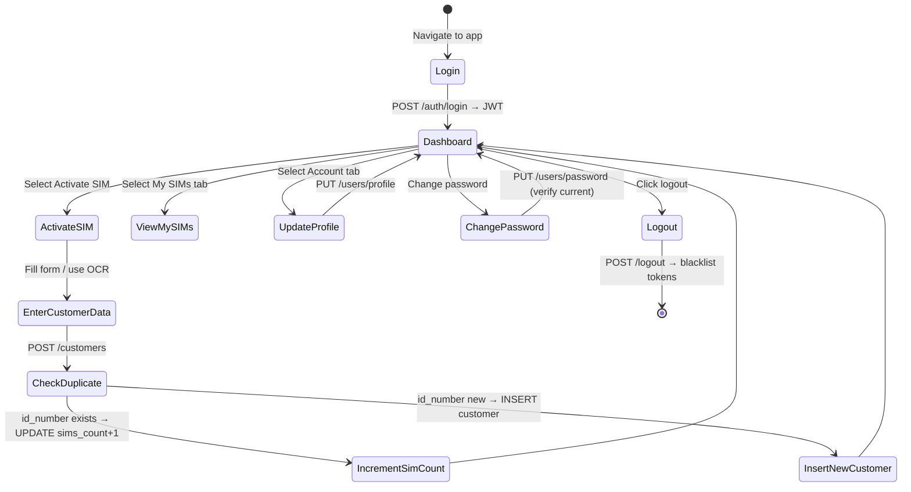

### PlantUML Activity Diagrams

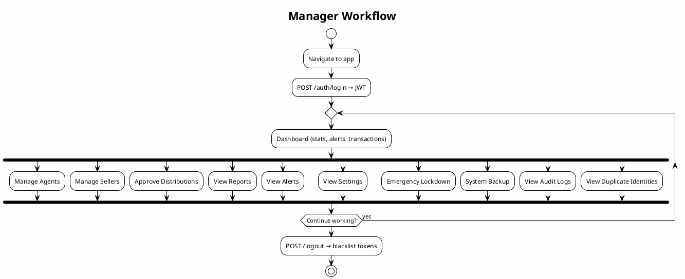

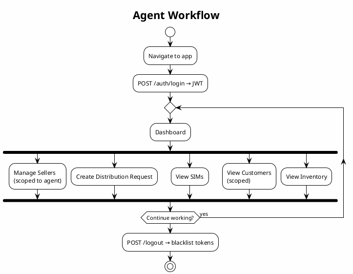

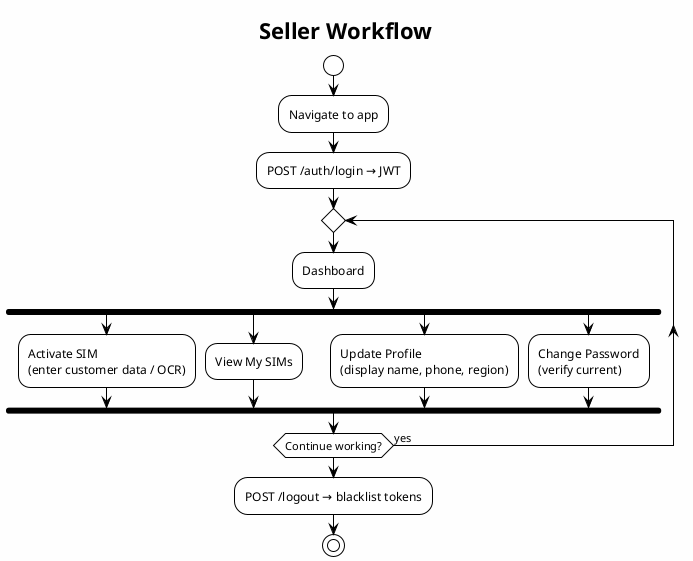

---

## 4. Data Flows (Sequence Diagrams)

### 4.1 Authentication Flow

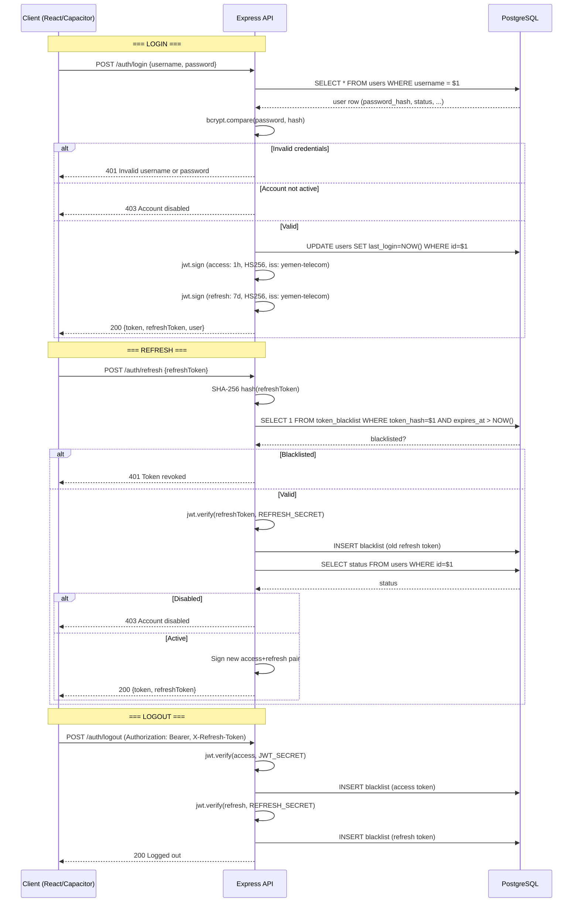

### 4.2 Customer Registration with Dedup

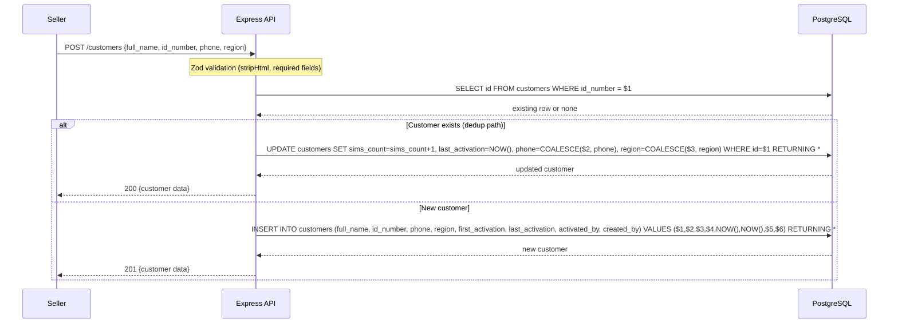

### 4.3 Distribution Request + Approval with Transaction

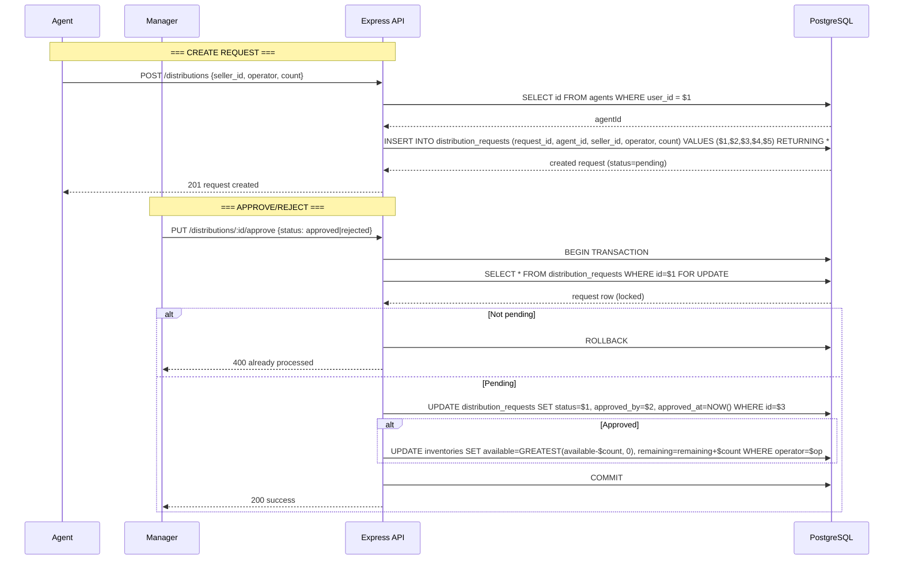

### 4.4 Image Upload with 3-Layer Validation

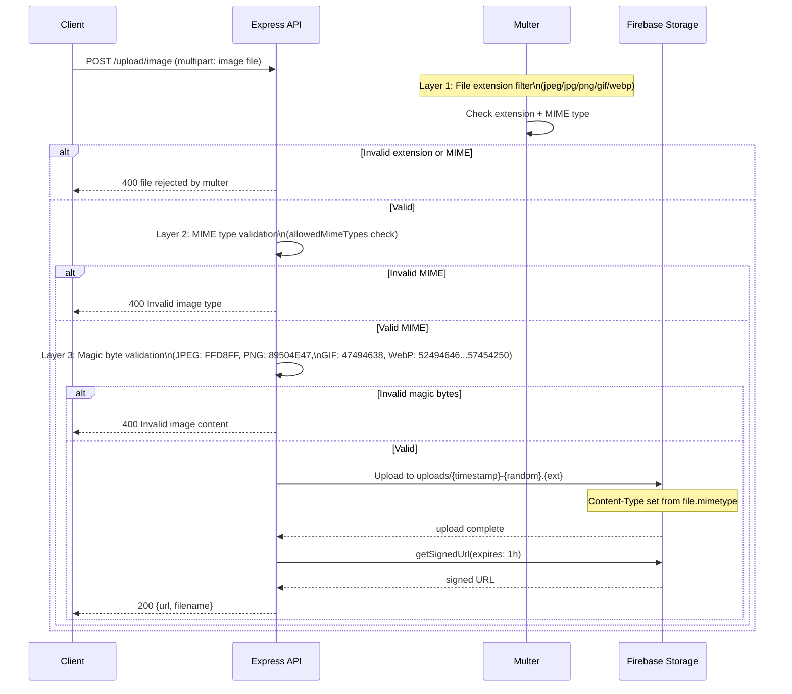

### PlantUML Sequence Diagrams

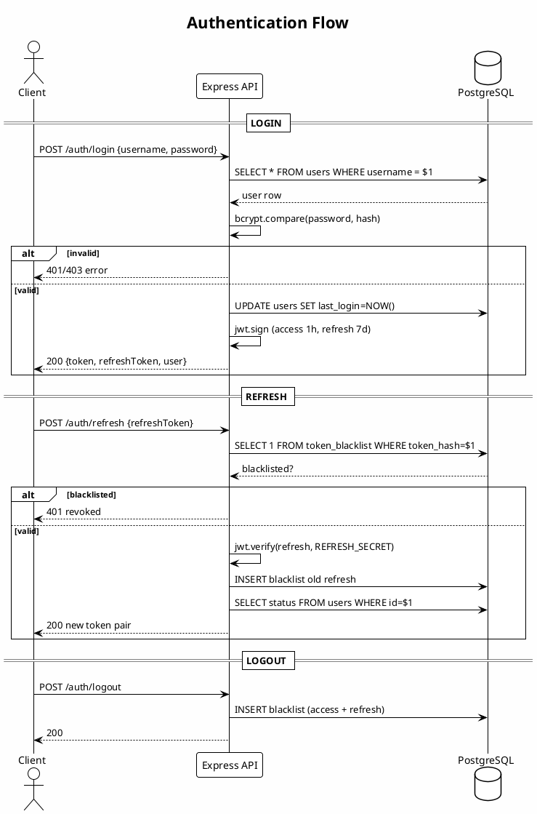

```plantuml
@uml
!theme plain
skinparam backgroundColor #FEFEFE

title Customer Registration with Dedup

actor Seller
participant "Express API" as API
database "PostgreSQL" as DB

Seller -> API: POST /customers {full_name, id_number, phone, region}
API -> DB: SELECT id FROM customers WHERE id_number = $1
alt exists
  API -> DB: UPDATE SET sims_count+1, last_activation=NOW()
  API --> Seller: 200 updated
else new
  API -> DB: INSERT INTO customers ...
  API --> Seller: 201 created
end
@enduml
```

```plantuml
@uml
!theme plain
skinparam backgroundColor #FEFEFE

title Distribution Request + Approval

actor Agent
actor Manager
participant "Express API" as API
database "PostgreSQL" as DB

== CREATE REQUEST ==
Agent -> API: POST /distributions {seller_id, operator, count}
API -> DB: INSERT distribution_requests (status=pending)
API --> Agent: 201

== APPROVE/REJECT ==
Manager -> API: PUT /distributions/:id/approve {status}
API -> DB: BEGIN
API -> DB: SELECT ... FOR UPDATE
API -> DB: UPDATE distribution_requests SET status=$1
alt approved
  API -> DB: UPDATE inventories SET available=GREATEST(available-$count, 0)
end
API -> DB: COMMIT
API --> Manager: 200
@enduml
```

---

## 5. Authorization Model

### 5.1 Role Hierarchy

```
manager (level 3) ──> agent (level 2) ──> seller (level 1)
     │                    │                    │
     │  Full access       │  Scoped access     │  Self access only
     │  All data visible  │  Own sellers +     │  Own profile +
     │  Admin operations  │  own customers     │  own customers
```

### 5.2 Permission Matrix

| View / API Group | Manager | Agent | Seller | Unauthenticated |
|---|---|---|---|---|
| POST /auth/login | — | — | — | ✓ (rate: 10/15min) |
| POST /auth/refresh | — | — | — | ✓ (rate: 20/15min) |
| POST /auth/logout | ✓ | ✓ | ✓ | ✗ |
| GET /auth/me | ✓ | ✓ | ✓ | ✗ |
| GET /api/csrf-token | — | — | — | ✓ |
| GET /api/health | — | — | — | ✓ |
| GET /api/stats | ✓ | ✗ | ✗ | ✗ |
| GET/POST/PUT/DELETE /sims | ✓ | ✓ (GET) | ✗ | ✗ |
| GET/POST/PUT /agents | ✓ | ✓ (GET) | ✗ | ✗ |
| GET/POST/PUT/DELETE /sellers | ✓ | ✓ (scoped) | ✓ (self) | ✗ |
| PUT /sellers/:id/balance | ✓ | ✓ (scoped) | ✗ | ✗ |
| POST /sellers/:id/reset-password | ✓ | ✓ (scoped) | ✗ | ✗ |
| GET/POST /customers | ✓ | ✓ (scoped) | ✓ (POST) | ✗ |
| GET /customers/search | ✓ | ✓ (scoped) | ✗ | ✗ |
| GET /customers/:id | ✓ | ✓ (scoped) | ✓ | ✗ |
| GET/POST /operations | ✓ | ✓ (scoped) | ✗ | ✗ |
| GET /inventories | ✓ | ✓ | ✗ | ✗ |
| PUT /inventories | ✓ | ✗ | ✗ | ✗ |
| GET/DELETE /alerts | ✓ | ✗ | ✗ | ✗ |
| GET/POST /distributions | ✓ | ✓ (scoped) | ✗ | ✗ |
| PUT /distributions/:id/approve | ✓ | ✗ | ✗ | ✗ |
| GET /distributions/pending-count | ✓ | ✗ | ✗ | ✗ |
| GET /reports/daily-sales | ✓ | ✗ | ✗ | ✗ |
| GET /reports/agent-performance | ✓ | ✗ | ✗ | ✗ |
| GET /reports/operator-distribution | ✓ | ✗ | ✗ | ✗ |
| GET /reports/seller-performance | ✓ | ✓ (scoped) | ✗ | ✗ |
| GET/PUT /admin/settings | ✓ | ✗ | ✗ | ✗ |
| GET /admin/transactions | ✓ | ✗ | ✗ | ✗ |
| GET /admin/duplicate-identities | ✓ | ✗ | ✗ | ✗ |
| GET /admin/audit-logs | ✓ | ✗ | ✗ | ✗ |
| POST /admin/system/backup | ✓ | ✗ | ✗ | ✗ |
| POST /admin/system/lockdown | ✓ | ✗ | ✗ | ✗ |
| POST /upload/image | ✓ | ✓ | ✗ | ✗ |
| POST /upload/images | ✓ | ✓ | ✗ | ✗ |
| PUT /users/password | ✓ | ✓ | ✓ | ✗ |
| PUT /users/profile | ✓ | ✓ | ✓ | ✗ |
| DELETE /users/account | ✓ | ✓ | ✓ | ✗ |

### 5.3 Data Scoping Strategy

Implemented via SQL `WHERE` clauses based on `req.user.role` and `req.user.id`:

```sql
-- Manager: no filter — sees all rows
SELECT * FROM sellers;

-- Agent: filter by agent profile derived from user_id
SELECT s.* FROM sellers s
JOIN agents a ON s.agent_id = a.id
WHERE a.user_id = $1;  -- req.user.id

-- Seller: filter by own user_id
SELECT * FROM sellers
WHERE user_id = $1;  -- req.user.id

-- Agent-scoped customers: filter by created_by
SELECT * FROM customers
WHERE created_by = $1;  -- req.user.id (agent)

-- Agent-scoped operations: filter by created_by
SELECT * FROM operations
WHERE created_by = $1;  -- req.user.id (agent)
```

Additional scoping logic for agent-specific operations:
- Agent can only update/delete/reset-password sellers if `seller.agent_id` matches the agent derived from `req.user.id`
- Double-check performed in route handlers before mutation
- Hard-coded `requireRole('manager')` on all admin, alerts, and system endpoints

### 5.4 API Protection Layers

```mermaid
flowchart LR
    subgraph "Layer 1 — Transport"
        T1[HTTPS enforced\nby Render]
    end
    subgraph "Layer 2 — Network"
        T2[CORS\n(origin whitelist)]
    end
    subgraph "Layer 3 — Request"
        T3[Helmet CSP\nsecurity headers]
        T4[Rate Limiter\n4 tiers]
        T5[CSRF double-submit\nHMAC-SHA256]
    end
    subgraph "Layer 4 — Auth"
        T6[JWT Bearer\nauthenticateToken]
        T7[Blacklist check\nSHA-256 hash lookup]
        T8[Account active\nstatus check]
    end
    subgraph "Layer 5 — Authorization"
        T9[requireRole\n(manager|agent|seller)]
        T10[Data scoping\nWHERE clause filtering]
    end
    subgraph "Layer 6 — Input"
        T11[Zod validation\n+ stripHtml XSS]
    end
    subgraph "Layer 7 — Mutation"
        T12[Maintenance mode\nblock check]
        T13[Write rate limiter\n30/min]
    end

    Request --> T1 --> T2 --> T3 --> T4 --> T5 --> T6 --> T7 --> T8 --> T9 --> T10 --> T11 --> T12 --> T13 --> Route
```

---

## 6. Integration Model

### External Integrations Overview

```mermaid
flowchart LR
    subgraph "Yemen Telecom Server"
        API[Express API\nPort 4000]
        POOL[pg Pool\nmax=10\nSSL]
    end
    subgraph "PostgreSQL"
        DB[(PostgreSQL 14+\nSupabase)]
    end
    subgraph "Firebase"
        FB[Firebase Storage\nuploads/ bucket]
        FBA[Firebase Admin SDK\nlazy init]
    end
    subgraph "S3-Compatible Storage"
        S3[S3 Bucket\nforcePathStyle\nbackups/ prefix]
    end

    API -->|pg Pool| DB
    API -->|Admin SDK| FB
    API -->|@aws-sdk/client-s3| S3

    DB -->|SSL connection| API
    FB -->|signed URL 1h| API
    S3 -->|presigned URL 1h| API
```

### Integration Details

| Integration | Technology | Connection | Auth | Purpose |
|---|---|---|---|---|
| **PostgreSQL** | `pg` Pool | SSL (configurable), max 10 conns, 15s timeout | DB_USER + DB_PASSWORD + optional CA cert | Primary data store |
| **Firebase Storage** | `firebase-admin` SDK | Lazy initialization (first upload) | Service account env vars (7 vars) | Image storage, signed URL access |
| **S3 Backup** | `@aws-sdk/client-s3` | `forcePathStyle: true` | BACKUP_S3_ACCESS_KEY_ID + BACKUP_S3_SECRET_ACCESS_KEY | Weekly/manual JSON backup of all 13 tables |

### Database Connection Config

| Parameter | Value | Configurable |
|---|---|---|
| Pool max | 10 | `DB_MAX_CONNECTIONS` |
| Connection timeout | 15000ms | Fixed |
| SSL | disabled for localhost, configurable for remote | Auto-detected via `DB_HOST` |
| rejectUnauthorized | true by default | `DB_SSL_REJECT_UNAUTHORIZED` |
| CA cert | optional | `DB_SSL_CA_CERT` |
| Family | optional | `DB_FAMILY` |
| Slow query threshold | 500ms | `DB_SLOW_QUERY_MS` |

---

## 7. Data Flow Architecture (DFD)

### DFD Level 0 — Context Diagram

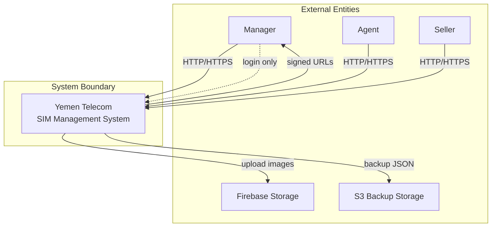

### DFD Level 1 — Processes, Data Stores, and Flows

```mermaid
flowchart TD
    subgraph "External Entities"
        MGR[Manager]
        AGT[Agent]
        SLR[Seller]
        FB_EXT[Firebase Storage]
        S3_EXT[S3 Backup Storage]
    end

    subgraph "Processes (13 Route Groups)"
        P1[Auth\nlogin/refresh/logout/me]
        P2[Users\npassword/profile/delete]
        P3[Agents\nCRUD]
        P4[Sellers\nCRUD/balance/reset-pwd]
        P5[SIMs\nCRUD]
        P6[Customers\nCRUD/dedup/search]
        P7[Operations\ncreate/list]
        P8[Inventories\nread/update]
        P9[Alerts\nlist/delete]
        P10[Distributions\nrequest/approve]
        P11[Reports\ndaily/performance/dist]
        P12[Admin\nsettings/logs/backup/lockdown]
        P13[Upload\nimage/files]
    end

    subgraph "Data Stores"
        D1[(users)]
        D2[(agents)]
        D3[(sellers)]
        D4[(sims)]
        D5[(customers)]
        D6[(operations)]
        D7[(inventories)]
        D8[(alerts)]
        D9[(distribution_requests)]
        D10[(transactions)]
        D11[(audit_logs)]
        D12[(duplicate_identities)]
        D13[(system_settings)]
        D14[(token_blacklist)]
        D15[(Firebase Storage)]
        D16[(S3 Backup)]
    end

    MGR -->|"POST /auth/login\nGET /auth/me"| P1
    AGT -->|"POST /auth/login\nGET /auth/me"| P1
    SLR -->|"POST /auth/login\nGET /auth/me"| P1
    MGR -->|"PUT /users/password\nPUT /users/profile"| P2
    AGT -->|"PUT /users/password\nPUT /users/profile"| P2
    SLR -->|"PUT /users/password\nPUT /users/profile"| P2
    MGR -->|"GET/POST/PUT /agents"| P3
    MGR -->|"GET/POST/PUT/DELETE\n/balance /reset-password"| P4
    AGT -->|"GET/POST/PUT/DELETE\n/balance /reset-password"| P4
    SLR -->|"GET /sellers"| P4
    MGR -->|"GET/POST/PUT/DELETE /sims"| P5
    AGT -->|"GET /sims"| P5
    MGR -->|"GET/POST /customers\nGET /customers/search"| P6
    AGT -->|"GET/POST /customers\nGET /customers/search"| P6
    SLR -->|"POST /customers\nGET /customers/:id"| P6
    MGR -->|"GET/POST /operations"| P7
    AGT -->|"GET/POST /operations"| P7
    MGR -->|"GET/PUT /inventories"| P8
    AGT -->|"GET /inventories"| P8
    MGR -->|"GET/DELETE /alerts"| P9
    MGR -->|"GET/PUT /distributions\n/approve"| P10
    AGT -->|"GET/POST /distributions"| P10
    MGR -->|"GET /reports/*"| P11
    AGT -->|"GET /reports/seller-performance"| P11
    MGR -->|"GET/PUT /admin/settings\nGET /transactions /audit-logs\n/duplicate-identities\nPOST /system/backup /lockdown"| P12
    MGR -->|"POST /upload/image(s)"| P13
    AGT -->|"POST /upload/image(s)"| P13

    P1 <-->|"SELECT/INSERT"| D1
    P1 <-->|"SELECT/INSERT"| D14
    P2 <-->|"UPDATE"| D1
    P3 <-->|"SELECT/INSERT/UPDATE"| D1
    P3 <-->|"SELECT/INSERT/UPDATE"| D2
    P4 <-->|"SELECT/INSERT/UPDATE/DELETE"| D1
    P4 <-->|"SELECT/UPDATE/DELETE"| D3
    P4 <-->|"SELECT"| D2
    P4 <-->|"UPDATE"| D4
    P5 <-->|"SELECT/INSERT/UPDATE/DELETE"| D4
    P6 <-->|"SELECT/INSERT/UPDATE"| D5
    P7 <-->|"SELECT/INSERT"| D6
    P8 <-->|"SELECT/UPDATE"| D7
    P9 <-->|"SELECT/DELETE"| D8
    P10 <-->|"SELECT/INSERT/UPDATE"| D9
    P10 <-->|"SELECT/UPDATE"| D7
    P11 -->|"SELECT"| D6
    P11 -->|"SELECT"| D3
    P11 -->|"SELECT"| D2
    P11 -->|"SELECT"| D4
    P12 <-->|"SELECT/UPDATE"| D13
    P12 -->|"SELECT"| D10
    P12 -->|"SELECT"| D11
    P12 -->|"SELECT"| D12
    P12 -->|"SELECT (13 tables)"| D16
    P12 <-->|"SELECT/UPDATE"| D3
    P12 <-->|"SELECT/UPDATE"| D13
    P13 -->|"upload"| D15
    P13 -->|"signed URL"| D15

    MGR -.->|"read"| D15
    AGT -.->|"read"| D15
```

### PlantUML DFD

```plantuml
@uml
!theme plain
skinparam backgroundColor #FEFEFE
skinparam componentStyle rectangle

title DFD Level 1 — Processes and Data Stores

rectangle MGR as "Manager"
rectangle AGT as "Agent"
rectangle SLR as "Seller"
rectangle FB as "Firebase Storage"
rectangle S3 as "S3 Backup"

package "Yemen Telecom System" {
  rectangle P1 as "Auth"
  rectangle P2 as "Users"
  rectangle P3 as "Agents"
  rectangle P4 as "Sellers"
  rectangle P5 as "SIMs"
  rectangle P6 as "Customers"
  rectangle P7 as "Operations"
  rectangle P8 as "Inventories"
  rectangle P9 as "Alerts"
  rectangle P10 as "Distributions"
  rectangle P11 as "Reports"
  rectangle P12 as "Admin"
  rectangle P13 as "Upload"
}

database D1 as "users"
database D2 as "agents"
database D3 as "sellers"
database D4 as "sims"
database D5 as "customers"
database D6 as "operations"
database D7 as "inventories"
database D8 as "alerts"
database D9 as "distribution_requests"
database D10 as "transactions"
database D11 as "audit_logs"
database D12 as "duplicate_identities"
database D13 as "system_settings"
database D14 as "token_blacklist"

MGR --> P1
AGT --> P1
SLR --> P1
MGR --> P2
AGT --> P2
SLR --> P2
MGR --> P3
MGR --> P4
AGT --> P4
SLR --> P4
MGR --> P5
AGT --> P5
MGR --> P6
AGT --> P6
SLR --> P6
MGR --> P7
AGT --> P7
MGR --> P8
AGT --> P8
MGR --> P9
MGR --> P10
AGT --> P10
MGR --> P11
AGT --> P11
MGR --> P12
MGR --> P13
AGT --> P13

P1 -down-> D1
P1 -down-> D14
P2 -down-> D1
P3 -down-> D1
P3 -down-> D2
P4 -down-> D1
P4 -down-> D3
P4 -down-> D2
P4 -down-> D4
P5 -down-> D4
P6 -down-> D5
P7 -down-> D6
P8 -down-> D7
P9 -down-> D8
P10 -down-> D9
P10 -down-> D7
P11 -down-> D6
P11 -down-> D3
P11 -down-> D2
P11 -down-> D4
P12 -down-> D13
P12 -down-> D10
P12 -down-> D11
P12 -down-> D12
P12 -down-> D3
P12 -down-> S3
P13 -down-> FB

@enduml
```
